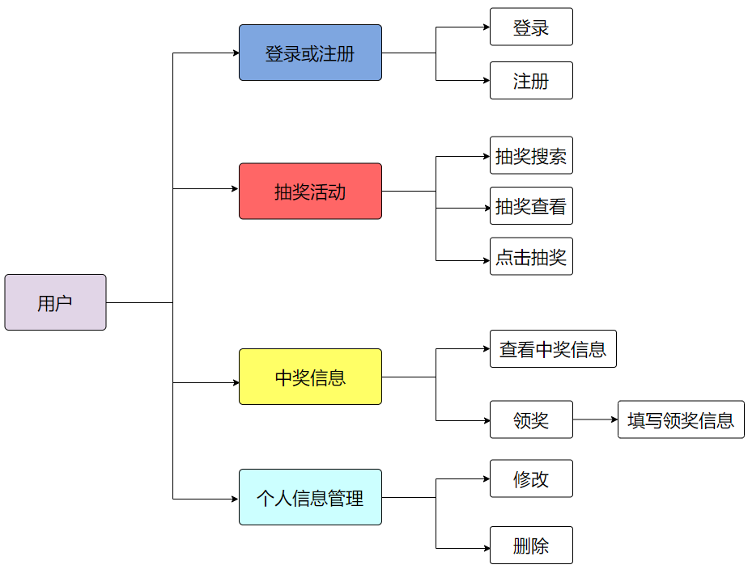
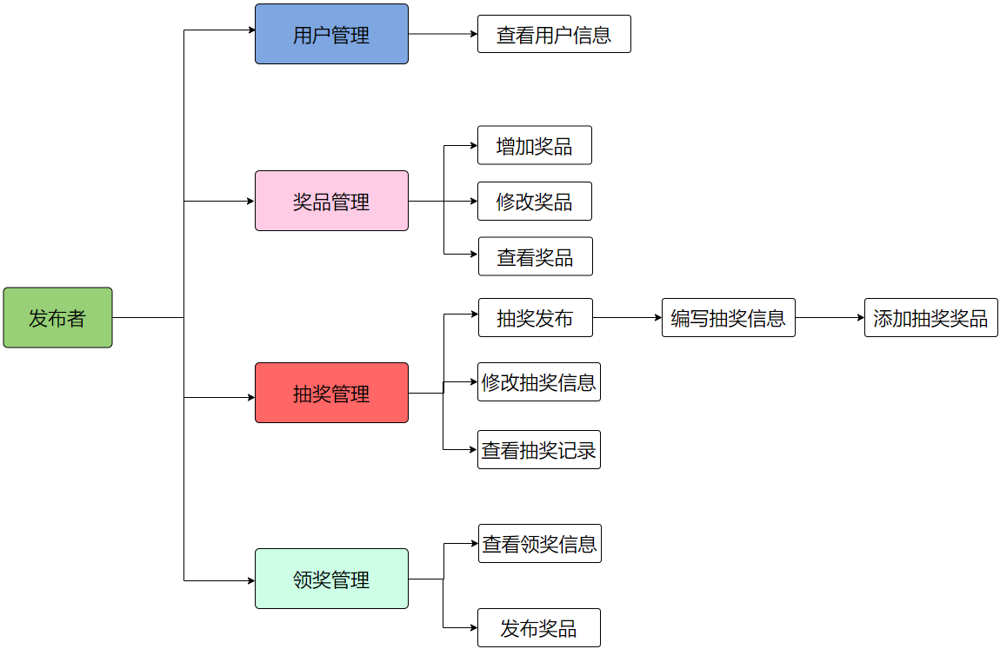
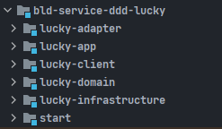
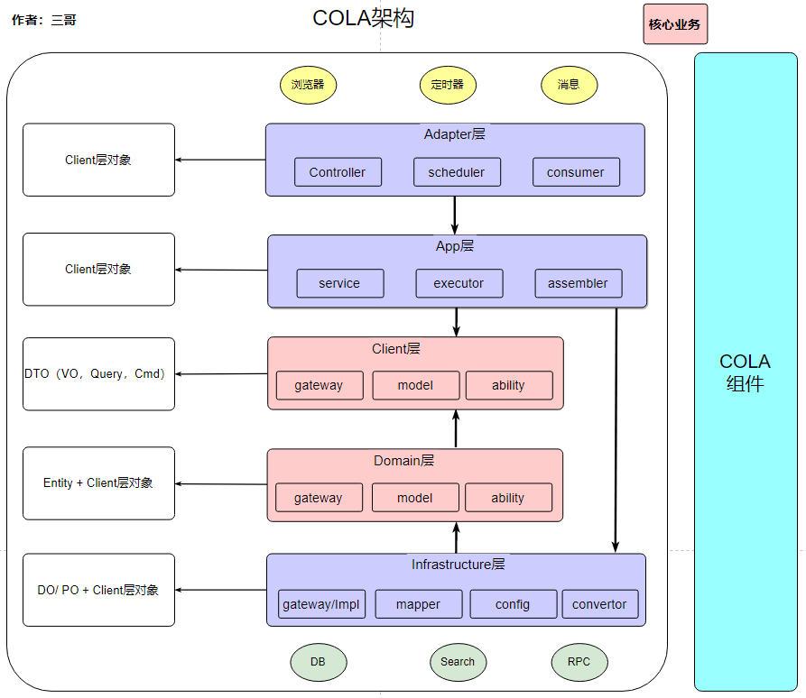
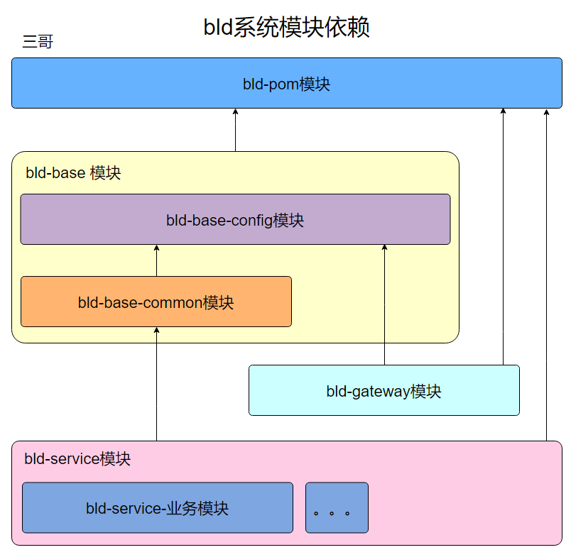
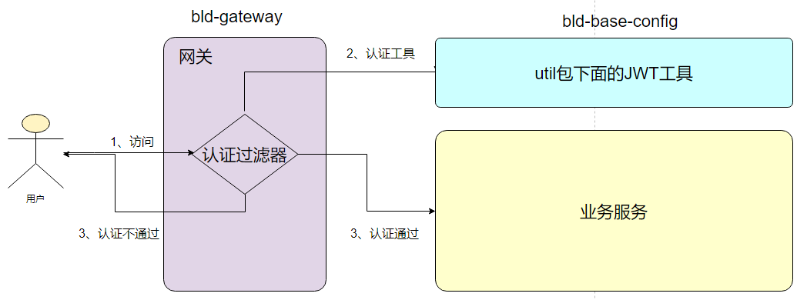
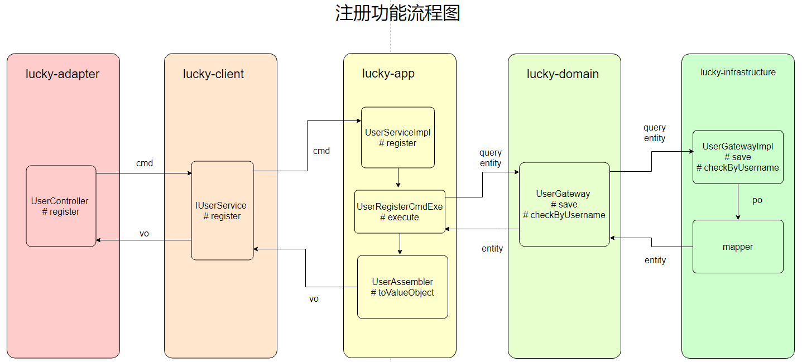
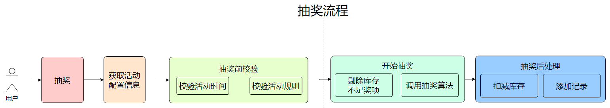

# 【三哥】抽奖系统文档

项目：lucky-draw-v1


联系作者加入微信、QQ交流群：📞[联系他](https://www.j3code.cn)

项目视频地址：👉[抽奖系统（创作不易，欢迎三连转发支持 😁）](https://www.bilibili.com/video/BV1284y1r7en/?vd_source=4562ef51231a6d65b7f829e8adbfe30b)

项目代码：👉[抽奖系统](https://gitee.com/j3_baiqi/lucky-draw-v1)

项目体验地址：👉[在线体验（12-9过期）](http://116.205.174.77/bld_app/index.html)

文档在线地址：👉[在线阅读](https://www.j3code.cn/myFile/static/resources/document/bld/bld_sys.html)


# 一、抽奖需求

一个抽奖项目，它可以分为参与抽奖的用户和抽奖活动的发布者。最简单的业务逻辑就是发布者发布抽奖活动，用户参与活动进行抽奖，所以我们先根据这一条业务线发散改项目该有那些功能。

先来分析抽奖用户应该具有什么功能：

1. 登录 / 注册账号
2. 修改个人信息及删除账号
3. 抽奖活动搜索
4. 抽奖活动查看
5. 参与抽奖
6. 查看抽奖记录（中奖和未中奖）
7. 领奖
8. 接收奖品
8. 等等…

接下来看看发布抽奖活动的发布者具有那些功能

1. 编写抽奖活动
2. 发布抽奖活动
3. 管理已经发布的抽奖活动
4. 动态修改活动属性
5. 查看参与抽奖的用户
6. 查看中奖用户
7. 发送奖品
8. 用户管理
8. 等等…

下面再来分析分析系统的核心功能，抽奖。

抽奖过程

1、抽奖准备（检查活动开始时间、检查活动限制）

2、开始抽奖（排除没有库存奖项，开始抽奖）

3、先扣减奖品库存再插入抽奖记录，最后返回抽奖结果

开始抽奖算法：根据奖项中的`概率权重`

# 二、功能分析图

用户：



发布者：




# 三、实体

1、用户（bld_user）

id

name

phone

password

creat_time

creator

update_time

updater

```sql
CREATE TABLE `bld_user` (
  `id` bigint(20) NOT NULL AUTO_INCREMENT,
  `username` varchar(50) COLLATE utf8mb4_german2_ci NOT NULL COMMENT '账号',
  `password` varchar(100) COLLATE utf8mb4_german2_ci NOT NULL COMMENT '密码',
  `name` varchar(10) COLLATE utf8mb4_german2_ci NOT NULL COMMENT '姓名',
  `phone` varchar(15) COLLATE utf8mb4_german2_ci NOT NULL COMMENT '电话',
  `create_time` datetime DEFAULT NULL,
  `creator` varchar(10) COLLATE utf8mb4_german2_ci DEFAULT NULL,
  `update_time` datetime DEFAULT NULL,
  `updater` varchar(10) COLLATE utf8mb4_german2_ci DEFAULT NULL,
  PRIMARY KEY (`id`)
) ENGINE=InnoDB DEFAULT CHARSET=utf8mb4 COLLATE=utf8mb4_german2_ci
```

2、活动（ld_activity）

id

activity_name

introduce

start_time

end_time

creat_time

creator

update_time

updater

```sql
CREATE TABLE `bld_activity` (
  `id` bigint(20) NOT NULL AUTO_INCREMENT,
  `activity_name` varchar(100) COLLATE utf8mb4_german2_ci NOT NULL COMMENT '活动名称',
  `start_time` datetime NOT NULL COMMENT '开始时间',
  `end_time` datetime NOT NULL COMMENT '结束时间',
  `describe` varchar(500) COLLATE utf8mb4_german2_ci NOT NULL COMMENT '描述',
  `create_time` datetime DEFAULT NULL,
  `creator` varchar(10) COLLATE utf8mb4_german2_ci DEFAULT NULL,
  `update_time` datetime DEFAULT NULL,
  `updater` varchar(10) COLLATE utf8mb4_german2_ci DEFAULT NULL,
  PRIMARY KEY (`id`)
) ENGINE=InnoDB DEFAULT CHARSET=utf8mb4 COLLATE=utf8mb4_german2_ci
```

3、奖品（bld_prize）

id

prize_name

inventory

creat_time

creator

update_time

updater

```sql
CREATE TABLE `bld_prize` (
  `id` bigint(20) NOT NULL AUTO_INCREMENT,
  `prize_name` varchar(20) COLLATE utf8mb4_german2_ci NOT NULL COMMENT '奖品名称',
  `inventory` int(11) NOT NULL COMMENT '库存',
  `money` decimal(10,0) DEFAULT NULL COMMENT '金额',
  `type` int(1) DEFAULT NULL COMMENT '类型（1：商品，2：金钱）',
  `create_time` datetime DEFAULT NULL,
  `cretor` varchar(10) COLLATE utf8mb4_german2_ci DEFAULT NULL,
  `update_time` datetime DEFAULT NULL,
  `updater` varchar(10) COLLATE utf8mb4_german2_ci DEFAULT NULL,
  PRIMARY KEY (`id`)
) ENGINE=InnoDB DEFAULT CHARSET=utf8mb4 COLLATE=utf8mb4_german2_ci
```

4、奖项（bld_award）

id

level

activity_id

prize_id

number

probability

creat_time

creator

update_time

updater

```sql
CREATE TABLE `bld_award` (
  `id` bigint(20) NOT NULL AUTO_INCREMENT,
  `prize_id` bigint(20) NOT NULL COMMENT '奖品名称',
  `number` int(11) NOT NULL COMMENT '数量',
  `award_name` varchar(40) COLLATE utf8mb4_german2_ci NOT NULL COMMENT '奖项名称',
  `probability` double NOT NULL COMMENT '概率',
  `create_time` datetime DEFAULT NULL,
  `creator` varchar(10) COLLATE utf8mb4_german2_ci DEFAULT NULL,
  `update_time` datetime DEFAULT NULL,
  `updater` varchar(10) COLLATE utf8mb4_german2_ci DEFAULT NULL,
  PRIMARY KEY (`id`)
) ENGINE=InnoDB DEFAULT CHARSET=utf8mb4 COLLATE=utf8mb4_german2_ci
```

5、规则（bld_rule）

id

activity_id

activity_join_number

max_winning_number

creat_time

creator

update_time

updater

```sql
CREATE TABLE `bld_rule` (
  `id` bigint(20) NOT NULL AUTO_INCREMENT,
  `rule_name` varchar(50) COLLATE utf8mb4_german2_ci NOT NULL COMMENT '规则名称',
  `max_join_number` int(11) NOT NULL COMMENT '最大可参与次数',
  `max_winning_number` int(11) NOT NULL COMMENT '最大可中奖次数',
  `create_time` datetime DEFAULT NULL,
  `creator` varchar(10) COLLATE utf8mb4_german2_ci DEFAULT NULL,
  `update_time` datetime DEFAULT NULL,
  `updater` varchar(10) COLLATE utf8mb4_german2_ci DEFAULT NULL,
  PRIMARY KEY (`id`)
) ENGINE=InnoDB DEFAULT CHARSET=utf8mb4 COLLATE=utf8mb4_german2_ci
```

6、抽奖记录（bld_record）

id

activity_id

user_id

results

creat_time

creator

update_time

updater

```sql
CREATE TABLE `bld_record` (
  `id` bigint(20) NOT NULL AUTO_INCREMENT,
  `user_id` bigint(20) NOT NULL COMMENT '用户id',
  `activity_id` bigint(20) NOT NULL COMMENT '活动id',
  `award_id` bigint(20) NOT NULL COMMENT '奖项id',
  `is_winning` tinyint(1) DEFAULT '0' COMMENT '是否中奖：0未中奖，1中奖',
  `state` int(11) DEFAULT NULL COMMENT '状态（0，1，2，3）',
  `create_time` datetime DEFAULT NULL,
  `creator` varchar(10) COLLATE utf8mb4_german2_ci DEFAULT NULL,
  `update_time` datetime DEFAULT NULL,
  `updater` varchar(10) COLLATE utf8mb4_german2_ci DEFAULT NULL,
  PRIMARY KEY (`id`)
) ENGINE=InnoDB DEFAULT CHARSET=utf8mb4 COLLATE=utf8mb4_german2_ci
```

7、领奖记录（bld_accept_prize）

id

draw_record_id

address

phone

state

creat_time

creator

update_time

updater

```sql
CREATE TABLE `bld_accept_prize` (
  `id` bigint(20) NOT NULL AUTO_INCREMENT,
  `record_id` bigint(20) NOT NULL COMMENT '抽奖记录id',
  `phone` varchar(15) COLLATE utf8mb4_german2_ci NOT NULL COMMENT '电话',
  `address` varchar(500) COLLATE utf8mb4_german2_ci NOT NULL COMMENT '地址',
  `create_time` datetime DEFAULT NULL,
  `creator` varchar(10) COLLATE utf8mb4_german2_ci DEFAULT NULL,
  `update_time` datetime DEFAULT NULL,
  `updater` varchar(10) COLLATE utf8mb4_german2_ci DEFAULT NULL,
  PRIMARY KEY (`id`)
) ENGINE=InnoDB DEFAULT CHARSET=utf8mb4 COLLATE=utf8mb4_german2_ci
```

# 四、COLA架构

详细内容在资料中找。

这里我仅仅介绍一下本项目中对应的模块及命名

模块



1）适配层（adapter）：负责对前端展示（web，wireless，wap）的路由和适配，对于传统B/S系统而言，adapter就相当于MVC中的controller；

2）应用层（app）：主要负责获取输入，组装上下文，参数校验，调用领域层做业务处理，如果需要的话，发送消息通知等。层次是开放的，应用层也可以绕过领域层，直接访问基础实施层；

3）领域层（domain）：主要是封装了核心业务逻辑，并通过领域服务（Domain Service）和领域对象（Domain Entity）的方法对App层提供业务实体和业务逻辑计算。领域是应用的核心，不依赖任何其他层次；

4）基础实施层（Infrastructure）：主要负责技术细节问题的处理，比如数据库的CRUD、搜索引擎、文件系统、分布式服务的RPC等。此外，领域防腐的重任也落在这里，外部依赖需要通过gateway的转义处理，才能被上面的App层和Domain层使用。

5）外部接口层（client）：对外提供的功能API，如果外部模块需要使用本项目功能只需引用 client 中的 API 接口即可实现功能。

包

| 层             | 包                           | 说明                                       |
| -------------- | ---------------------------- | ------------------------------------------ |
| adapter        | web                          | 处理页面请求的Controller                   |
| app            | 业务功能包（user、order）    | 业务名                                     |
| app            | assembler                    | 将 entity 转为 vo                          |
| app            | command                      | 修改相关的执行逻辑                         |
| app            | query                        | 查询相关的执行逻辑                         |
| client         | api                          | 存放对外功能的api                          |
| client         | dto（data、query）           | 对外返回的对象及调用方传入的参数对象       |
| domain         | gateway                      | 防腐层，让 Infrastructure 层实现逻辑       |
| domain         | 业务功能包（entity、值对象） | 根据业务功能分包，包中存放业务实体及值对象 |
| infrastructure | convertor                    | 存放将 DO 转化为 entity的类                |
| infrastructure | config                       | 存放配置相关                               |
| infrastructure | gateway.impl                 | 实现 domain 层的 gateway 接口的实现类      |
| infrastructure | dataobject                   | 存放数据库对象的DO                         |
| infrastructure | mapper                       | mapper文件                                 |

本项目依赖及COLA架构实践图：




因为本项目涉及到非常多的实体间转换，所以推荐一个实体间转化插件：

https://www.j3code.cn/clip_web/index.html?name=j3&showLookModalOpen=true&clipContentId=186

# 五、后端项目搭建

## 5.1 创建根项目

名称：bot-lucky-draw

环境：JDK11、Maven3.5+

删除 src 文件，根项目不需要这个

pom配置

```xml
<?xml version="1.0" encoding="UTF-8"?>
<project xmlns="http://maven.apache.org/POM/4.0.0" xmlns:xsi="http://www.w3.org/2001/XMLSchema-instance"
         xsi:schemaLocation="http://maven.apache.org/POM/4.0.0 https://maven.apache.org/xsd/maven-4.0.0.xsd">
    <modelVersion>4.0.0</modelVersion>
    <parent>
        <groupId>org.springframework.boot</groupId>
        <artifactId>spring-boot-starter-parent</artifactId>
        <version>2.5.0</version>
        <relativePath/> <!-- lookup parent from repository -->
    </parent>
    <groupId>cn.j3code</groupId>
    <artifactId>bot-lucky-draw</artifactId>
    <version>BLD.2022.10.25.RELEASE</version>
    <packaging>pom</packaging>

    <dependencyManagement>
        <dependencies>
            <dependency>
                <groupId>org.springframework.cloud</groupId>
                <artifactId>spring-cloud-dependencies</artifactId>
                <version>2020.0.4</version>
                <type>pom</type>
                <scope>import</scope>
            </dependency>

            <dependency>
                <groupId>com.alibaba.cloud</groupId>
                <artifactId>spring-cloud-alibaba-dependencies</artifactId>
                <version>2021.1</version>
                <type>pom</type>
                <scope>import</scope>
            </dependency>
        </dependencies>
    </dependencyManagement>

    <properties>
        <bld.version>BLD.2022.10.15.RELEASE</bld.version>
        <org.mapstruct.version>1.4.2.Final</org.mapstruct.version>
        <lombok.version>1.18.10</lombok.version>
        <java.version>11</java.version>
        <simbot.version>2.3.0</simbot.version>
        <maven.compiler.source>11</maven.compiler.source>
        <maven.compiler.target>${maven.compiler.source}</maven.compiler.target>
        <project.build.sourceEncoding>UTF-8</project.build.sourceEncoding>
        <project.reporting.outputEncoding>UTF-8</project.reporting.outputEncoding>
        <maven.deploy.skip>true</maven.deploy.skip>
        <cola.components.version>4.3.1</cola.components.version>
    </properties>


    <modules>
        
    </modules>


    <build>
        <plugins>
            <plugin>
                <groupId>org.apache.maven.plugins</groupId>
                <artifactId>maven-surefire-plugin</artifactId>
                <version>2.19.1</version>
                <configuration>
                    <skipTests>true</skipTests>    <!--默认关掉单元测试 -->
                </configuration>
            </plugin>
            <plugin>
                <groupId>org.apache.maven.plugins</groupId>
                <artifactId>maven-compiler-plugin</artifactId>
                <version>3.8.1</version>
                <configuration>
                    <source>11</source> <!-- depending on your project -->
                    <target>11</target> <!-- depending on your project -->
                    <annotationProcessorPaths>
                        <path>
                            <groupId>org.projectlombok</groupId>
                            <artifactId>lombok</artifactId>
                            <version>${lombok.version}</version>
                        </path>
                        <path>
                            <groupId>org.mapstruct</groupId>
                            <artifactId>mapstruct-processor</artifactId>
                            <version>${org.mapstruct.version}</version>
                        </path>
                        <!-- other annotation processors -->
                    </annotationProcessorPaths>
                </configuration>
            </plugin>
        </plugins>

        <resources>
            <!--编译配置文件-->
            <resource>
                <directory>src/main/resources</directory>
                <includes>
                    <include>**/*.*</include>
                </includes>
            </resource>
        </resources>
    </build>

</project>
```

## 5.2 创建依赖模块

名称：bld-pom

删除 src 文件，根依赖模块不需要这个

该模块只有一个 pom.xml 文件，因为它仅仅作为项目需要引入的公共依赖支持。

将项目中的所有公共依赖都放在统一的模块中便于管理，如果具体服务需要一些特定的功能依赖只需要在自己模块中的 pom 文件中添加即可，反之如果一个依赖被多个模块使用，那么建议放在这个公共依赖模块。

pom.xml 依赖配置

```xml
<?xml version="1.0" encoding="UTF-8"?>
<project xmlns="http://maven.apache.org/POM/4.0.0" xmlns:xsi="http://www.w3.org/2001/XMLSchema-instance"
         xsi:schemaLocation="http://maven.apache.org/POM/4.0.0 https://maven.apache.org/xsd/maven-4.0.0.xsd">
    <modelVersion>4.0.0</modelVersion>
    <parent>
        <artifactId>bot-lucky-draw</artifactId>
        <groupId>cn.j3code</groupId>
        <version>BLD.2022.10.25.RELEASE</version>
    </parent>
    <packaging>jar</packaging>
    <artifactId>bld-pom</artifactId>

    <dependencies>

        <dependency>
            <groupId>org.springframework.boot</groupId>
            <artifactId>spring-boot-starter</artifactId>
            <exclusions>
                <exclusion>
                    <artifactId>log4j-api</artifactId>
                    <groupId>org.apache.logging.log4j</groupId>
                </exclusion>
            </exclusions>
        </dependency>


        <!--web 启动器-->
        <dependency>
            <groupId>org.springframework.boot</groupId>
            <artifactId>spring-boot-starter-web</artifactId>
        </dependency>

        <!--bootstrap配置生效-->
        <dependency>
            <groupId>org.springframework.cloud</groupId>
            <artifactId>spring-cloud-starter-bootstrap</artifactId>
        </dependency>
        <!--feign-->
        <dependency>
            <groupId>org.springframework.cloud</groupId>
            <artifactId>spring-cloud-starter-openfeign</artifactId>
        </dependency>
        <!--nacos-->
        <dependency>
            <groupId>com.alibaba.cloud</groupId>
            <artifactId>spring-cloud-starter-alibaba-nacos-discovery</artifactId>
            <exclusions>
                <exclusion>
                    <groupId>com.netflix.ribbon</groupId>
                    <artifactId>ribbon</artifactId>
                </exclusion>
            </exclusions>
        </dependency>
        <!--排除nacos中的负载均衡组件，自己添加配合feign使用-->
        <dependency>
            <groupId>org.springframework.cloud</groupId>
            <artifactId>spring-cloud-loadbalancer</artifactId>
        </dependency>
        <!--mysql-->
        <dependency>
            <groupId>mysql</groupId>
            <artifactId>mysql-connector-java</artifactId>
            <version>8.0.25</version>
        </dependency>
        <!--redis-->
        <dependency>
            <groupId>org.springframework.boot</groupId>
            <artifactId>spring-boot-starter-data-redis</artifactId>
        </dependency>
        <!--mybatis-plus-->
        <dependency>
            <groupId>com.baomidou</groupId>
            <artifactId>mybatis-plus-boot-starter</artifactId>
            <version>3.4.3.4</version>
        </dependency>
        <!--rocketmq-->
        <dependency>
            <groupId>org.apache.rocketmq</groupId>
            <artifactId>rocketmq-spring-boot-starter</artifactId>
            <version>2.2.1</version>
        </dependency>
        <!--阿里连接池-->
        <dependency>
            <groupId>com.alibaba</groupId>
            <artifactId>druid</artifactId>
            <version>1.2.8</version>
        </dependency>
        <!-- fastjson依赖 -->
        <dependency>
            <groupId>com.alibaba</groupId>
            <artifactId>fastjson</artifactId>
            <version>1.2.78</version>
        </dependency>
        <!--hutool工具包-->
        <dependency>
            <groupId>cn.hutool</groupId>
            <artifactId>hutool-all</artifactId>
            <version>5.2.0</version>
        </dependency>
        <dependency>
            <groupId>com.squareup.okhttp3</groupId>
            <artifactId>okhttp</artifactId>
        </dependency>
        <!--邮件-->
        <dependency>
            <groupId>com.sun.mail</groupId>
            <artifactId>javax.mail</artifactId>
            <version>1.6.2</version>
        </dependency>
        <dependency>
            <groupId>com.github.ulisesbocchio</groupId>
            <artifactId>jasypt-spring-boot-starter</artifactId>
            <version>3.0.3</version>
        </dependency>
        <!--lombok-->
        <dependency>
            <groupId>org.projectlombok</groupId>
            <artifactId>lombok</artifactId>
            <version>${lombok.version}</version>
        </dependency>
        <!--OSS文件服务-->
        <dependency>
            <groupId>com.aliyun.oss</groupId>
            <artifactId>aliyun-sdk-oss</artifactId>
            <version>3.10.2</version>
        </dependency>
        <!--校验-->
        <dependency>
            <groupId>org.springframework.boot</groupId>
            <artifactId>spring-boot-starter-validation</artifactId>
        </dependency>
        <!--转换-->
        <dependency>
            <groupId>org.mapstruct</groupId>
            <artifactId>mapstruct</artifactId>
            <version>${org.mapstruct.version}</version>
        </dependency>
        <!--test-->
        <dependency>
            <groupId>org.springframework.boot</groupId>
            <artifactId>spring-boot-test</artifactId>
            <scope>test</scope>
        </dependency>
        <dependency>
            <groupId>org.springframework.boot</groupId>
            <artifactId>spring-boot-starter-test</artifactId>
            <scope>test</scope>
        </dependency>
        <dependency>
            <groupId>junit</groupId>
            <artifactId>junit</artifactId>
            <scope>test</scope>
        </dependency>
        <!-- JWT-->
        <dependency>
            <groupId>com.auth0</groupId>
            <artifactId>java-jwt</artifactId>
            <version>4.2.1</version>
        </dependency>
    </dependencies>

</project>
```

这里说一下引入的依赖作用

- spring-boot-starter：基础项目框架
- spring-boot-starter-web：web相关
- spring-cloud-starter-bootstrap：bootstrap.yml 配置生效
- spring-cloud-starter-openfeign：Feign 调用支持
- spring-cloud-starter-alibaba-nacos-discovery：服务注册中心
- mysql-connector-java：数据库驱动
- spring-boot-starter-data-redis：Redis 依赖
- mybatis-plus-boot-starter：持久层依赖
- druid：数据库连接池
- fastjson：序列化依赖
- hutool-all：工具类
- okhttp：远程http调用依赖
- javax.mail：邮件依赖
- jasypt-spring-boot-starter：敏感内容加密依赖
- lombok：方便生成对应的get、set
- aliyun-sdk-oss：OSS服务
- spring-boot-starter-validation：校验相关
- mapstruct：对象转换
- java-jwt：JWT依赖


## 5.3 创建公共模块

在功能模块中，我又分为了：

- 公共配置
- 功能组件

至于，为什么这么分，还是那句话，便于管理。

先创建一个公共配置模块

名称：bld-base

删除 src 文件，根模块不需要这个

pom文件配置

```xml
<?xml version="1.0" encoding="UTF-8"?>
<project xmlns="http://maven.apache.org/POM/4.0.0" xmlns:xsi="http://www.w3.org/2001/XMLSchema-instance"
         xsi:schemaLocation="http://maven.apache.org/POM/4.0.0 https://maven.apache.org/xsd/maven-4.0.0.xsd">
    <modelVersion>4.0.0</modelVersion>
    <parent>
        <artifactId>bot-lucky-draw</artifactId>
        <groupId>cn.j3code</groupId>
        <version>BLD.2022.10.25.RELEASE</version>
    </parent>

    <packaging>pom</packaging>
    <artifactId>bld-base</artifactId>

    <modules>
        <module>bld-base-config</module>
        <module>bld-base-common</module>
    </modules>

    <dependencies>
        <dependency>
            <groupId>cn.j3code</groupId>
            <artifactId>bld-pom</artifactId>
            <version>${project.version}</version>
        </dependency>
    </dependencies>

</project>
```

接下来创建其子模块

### 5.3.1 创建公共组件模块

名称：bld-base-common

组件，顾名思义就是需要被归纳到具体服务中完成对应功能的，所以类似自动装配，让容器管理。

pom.xml 文件配置

```xml
<?xml version="1.0" encoding="UTF-8"?>
<project xmlns="http://maven.apache.org/POM/4.0.0" xmlns:xsi="http://www.w3.org/2001/XMLSchema-instance"
         xsi:schemaLocation="http://maven.apache.org/POM/4.0.0 https://maven.apache.org/xsd/maven-4.0.0.xsd">
    <modelVersion>4.0.0</modelVersion>
    <parent>
        <artifactId>bld-base</artifactId>
        <groupId>cn.j3code</groupId>
        <version>BLD.2022.10.25.RELEASE</version>
    </parent>
    <packaging>jar</packaging>
    <artifactId>bld-base-common</artifactId>

    <dependencies>
        <dependency>
            <groupId>cn.j3code</groupId>
            <artifactId>bld-base-config</artifactId>
            <version>${project.version}</version>
        </dependency>
    </dependencies>


</project>
```

### 5.3.2 创建公共配置模块

名称：bld-base-config

配置，该模块是做功能配置管理有yml、utils、enum等，可以不被容器管理但又能加载到classpath中所引用到。

pom.xml 文件配置

```xml
<?xml version="1.0" encoding="UTF-8"?>
<project xmlns="http://maven.apache.org/POM/4.0.0" xmlns:xsi="http://www.w3.org/2001/XMLSchema-instance"
         xsi:schemaLocation="http://maven.apache.org/POM/4.0.0 https://maven.apache.org/xsd/maven-4.0.0.xsd">
    <modelVersion>4.0.0</modelVersion>
    <parent>
        <artifactId>bld-base</artifactId>
        <groupId>cn.j3code</groupId>
        <version>BLD.2022.10.25.RELEASE</version>
    </parent>
    <packaging>jar</packaging>
    <artifactId>bld-base-config</artifactId>

    <dependencies>

    </dependencies>
</project>
```

## 5.4 创建网关模块

名称：bld-gateway

后续项目的所有请求入口都要走网关。

pom.xml文件配置

```xml
<?xml version="1.0" encoding="UTF-8"?>
<project xmlns="http://maven.apache.org/POM/4.0.0" xmlns:xsi="http://www.w3.org/2001/XMLSchema-instance"
         xsi:schemaLocation="http://maven.apache.org/POM/4.0.0 https://maven.apache.org/xsd/maven-4.0.0.xsd">
    <modelVersion>4.0.0</modelVersion>
    <parent>
        <artifactId>bot-lucky-draw</artifactId>
        <groupId>cn.j3code</groupId>
        <version>BLD.2022.10.25.RELEASE</version>
    </parent>
    <packaging>jar</packaging>
    <artifactId>bld-gateway</artifactId>

    <dependencies>
        <dependency>
            <groupId>cn.j3code</groupId>
            <artifactId>bld-pom</artifactId>
            <version>${project.version}</version>
            <exclusions>
                <exclusion>
                    <groupId>org.springframework.boot</groupId>
                    <artifactId>spring-boot-starter-web</artifactId>
                </exclusion>
                <exclusion>
                    <groupId>mysql</groupId>
                    <artifactId>mysql-connector-java</artifactId>
                </exclusion>
                <!--mybatis-plus-->
                <exclusion>
                    <groupId>com.baomidou</groupId>
                    <artifactId>mybatis-plus-boot-starter</artifactId>
                </exclusion>
                <!--阿里连接池-->
                <exclusion>
                    <groupId>com.alibaba</groupId>
                    <artifactId>druid</artifactId>
                </exclusion>
            </exclusions>
        </dependency>

        <!--网关-->
        <dependency>
            <groupId>org.springframework.cloud</groupId>
            <artifactId>spring-cloud-starter-gateway</artifactId>
        </dependency>

        <dependency>
            <groupId>cn.j3code</groupId>
            <artifactId>bld-base-config</artifactId>
            <version>${project.version}</version>
        </dependency>
    </dependencies>


    <build>
        <plugins>
            <!-- Springboot打包插件。使用 mvn package 进行打包。 -->
            <plugin>
                <groupId>org.springframework.boot</groupId>
                <artifactId>spring-boot-maven-plugin</artifactId>
                <version>2.5.3</version>
                <configuration>
                    <!-- main方法所在类。 -->
                    <mainClass>cn.j3code.bldgateway.BldGatewayApplication</mainClass>
                </configuration>
                <executions>
                    <execution>
                        <goals>
                            <goal>repackage</goal>
                        </goals>
                    </execution>
                </executions>
            </plugin>
        </plugins>
        <resources>
            <!--编译配置文件-->
            <resource>
                <directory>src/main/resources</directory>
                <includes>
                    <include>**/*.*</include>
                </includes>
            </resource>
        </resources>
    </build>
</project>
```

## 5.5 创建业务服务跟模块

名称：bld-service

后续项目中所有和业务相关的模块，都放在这里，根据功能不同创建对应的子模块。

pom.xml 文件配置

```xml
<?xml version="1.0" encoding="UTF-8"?>
<project xmlns="http://maven.apache.org/POM/4.0.0" xmlns:xsi="http://www.w3.org/2001/XMLSchema-instance"
         xsi:schemaLocation="http://maven.apache.org/POM/4.0.0 https://maven.apache.org/xsd/maven-4.0.0.xsd">
    <modelVersion>4.0.0</modelVersion>
    <parent>
        <artifactId>bot-lucky-draw</artifactId>
        <groupId>cn.j3code</groupId>
        <version>BLD.2022.10.25.RELEASE</version>
    </parent>
    <packaging>pom</packaging>
    <artifactId>bld-service</artifactId>

    <modules>

    </modules>

    <dependencies>
        <dependency>
            <groupId>cn.j3code</groupId>
            <artifactId>bld-base-common</artifactId>
            <version>${project.version}</version>
        </dependency>
    </dependencies>

</project>
```

## 5.6 各个模块间的依赖关系图



# 六、统一返回结果封装

为什么要做这个，方便前后端数据联调。

后端返回统一的数据格式，前端则方便接收数据和回显数据，提升快发速度。

统一返回格式一般包括下面几个字段

- 结果
- 返回码
- 消息（可选）
- 数据

格式

```json
{
    "result": true,
    "code": 200,
    "message": "操作成功！"
    "data": Object
}
```

代码体现

1、编写结果信息对象

```java
@Getter
public abstract class ResultInfo implements Serializable {

    protected Boolean result;
    protected Integer code;
    @JsonInclude(JsonInclude.Include.NON_NULL)
    protected String message;

    protected ResultInfo(Boolean result, Integer code, String message) {
        this.result = result;
        this.code = code;
        this.message = message;
    }

}
```

2、编写成功结果集对象

```java
@Builder
@Getter
@ToString
public class SuccessInfo extends ResultInfo {

    protected static final Integer DEFAULT_CODE = 20000;
    protected static final String DEFAULT_MESSAGE = "操作成功";

    @JsonInclude(JsonInclude.Include.NON_NULL)
    protected Object data;


    protected SuccessInfo(Object data) {
        super(true, DEFAULT_CODE, DEFAULT_MESSAGE);
        this.data = data;
    }
}
```

3、编写失败结果集对象

```java
@Builder
@Getter
@ToString
public class FailInfo extends ResultInfo {

    protected static final Integer DEFAULT_CODE = 50000;
    protected static final String DEFAULT_MESSAGE = "操作失败";

    @JsonInclude(JsonInclude.Include.NON_NULL)
    private final String exception;

    protected FailInfo(String exception) {
        super(false, DEFAULT_CODE, DEFAULT_MESSAGE);
        this.exception = exception;
    }
    public FailInfo(Integer code, String exception) {
        super(false, code, DEFAULT_MESSAGE);
        this.exception = exception;
    }

}
```

4、编写需要处理结果集的注解

```java
@Retention(RetentionPolicy.RUNTIME)
@Target({ElementType.TYPE, ElementType.METHOD})
@Documented
@RestController
public @interface ResponseResult {
    boolean ignore() default false;
}
```

以后，如果需要将 controller 中的数据通过统一结果返回出去，就需要在类或方法上标注该注解才会生效。

4、编写返回结果处理器

```java
@Slf4j
@ControllerAdvice
@AllArgsConstructor
public class ResponseResultHandler implements ResponseBodyAdvice<Object> {
    @Override
    public boolean supports(MethodParameter methodParameter, Class<? extends HttpMessageConverter<?>> aClass) {

        final var method = methodParameter.getMethod();
        final var clazz = Objects.requireNonNull(method, "method is null").getDeclaringClass();

        // 只处理 ResponseResult 标注的类或方法
        var annotation = clazz.getAnnotation(ResponseResult.class);
        if (Objects.isNull(annotation)) {
            annotation = method.getAnnotation(ResponseResult.class);
        }

        //如果是FileSystemResource 则不拦截
        if (method.getAnnotatedReturnType().getType().getTypeName()
                .equals(FileSystemResource.class.getTypeName())) {
            return false;
        }
        return annotation != null && !annotation.ignore();
    }

    @SneakyThrows
    @Override
    public Object beforeBodyWrite(Object data, MethodParameter methodParameter, MediaType mediaType, Class<? extends HttpMessageConverter<?>> aClass, ServerHttpRequest serverHttpRequest, ServerHttpResponse serverHttpResponse) {
        var successInfo = SuccessInfo.builder()
                .data(data)
                .build();
        if ((data instanceof String) && !MediaType.APPLICATION_XML_VALUE.equals(mediaType.toString())) {
            ObjectMapper om = new ObjectMapper();
            serverHttpResponse.getHeaders().set("Content-Type", "application/json");
            return om.writeValueAsString(successInfo);
        }

        if (Objects.isNull(data) && MediaType.TEXT_HTML_VALUE.equals(mediaType.toString())) {
            ObjectMapper om = new ObjectMapper();
            serverHttpResponse.getHeaders().set("Content-Type", "application/json");
            return om.writeValueAsString(successInfo);
        }

        return successInfo;
    }
}
```

该结果处理类实现了 ResponseBodyAdvice 接口并且标注了 @ControllerAdvice 注解，相当于一个返回结果集的切面，supports 方法表示是否需要增强，beforeBodyWrite 表示增强方法。

方法实现逻辑：

1. 先 supports  方法判断 Controller 中的类或方法上是否标注 @ResponseResult 注解，有则返回 true（增强） 反之 false（不增强）
2. 返回增强的则会来到 beforeBodyWrite 方法处理结果集，在此我们就可以创建一个成功的结果集将返回结果设置到成功对象的 data 中，最后通过 JSON 序列化返回出去。

# 七、统一异常处理

当系统出现错误时，给前端返回一个统一的错误格式非常重要，这里的铺垫是先把统一结果集的处理完成好。

当后端出错是，程序就要返回前端一个错误的结果集对象了 FailInfo ，那谁来生成 FailInfo 对象并返回呢！

@ControllerAdvice 注解又出现了。

编写一个错误处理类，如下：

```java
@Slf4j
@ControllerAdvice
public class SysExceptionHandler {

    /**
     * 最大的兜底错误处理
     *
     * @param ex
     * @return
     */
    @ResponseBody
    @ExceptionHandler(value = Exception.class)
    public FailInfo exception(Exception ex) {
        log.error("Exception_info:{}", ex.getMessage());
        log.error("Exception_info:", ex);
        var failInfo = FailInfo.builder().exception(ex.getMessage()).build();
        return failInfo;
    }

    /**
     * 参数绑定错误
     *
     * @param ex
     * @return
     */
    @ResponseBody
    @ExceptionHandler(value = BindException.class)
    public FailInfo exception(BindException ex) {
        String defaultMessage = Objects.requireNonNull(ex.getBindingResult().getFieldError()).getDefaultMessage();
        log.error("Exception_info:{}", defaultMessage);
        log.error("Exception_info:", ex);
        var failInfo = FailInfo.builder().exception(defaultMessage).build();
        return failInfo;
    }


    @ResponseBody
    @ExceptionHandler(value = BldException.class)
    public FailInfo sysException(Exception ex) {
        log.error("Exception_info:{}", ex.getMessage());
        log.error("Exception_info:", ex);
        var failInfo = FailInfo.builder().exception(ex.getMessage()).build();
        return failInfo;
    }

    @ResponseBody
    @ExceptionHandler(value = NotAuthException.class)
    public FailInfo notAuthException(Exception ex) {
        log.error("Exception_info:{}", ex.getMessage());
        log.error("Exception_info:", ex);
        return new FailInfo(401, ex.getMessage());
    }

    @ResponseBody
    @ExceptionHandler(value = MysqlDataTruncation.class)
    public FailInfo mysqlDataTruncation(Exception ex) {
        log.error("Exception_info:{}", ex.getMessage());
        log.error("Exception_info:", ex);
        return new FailInfo(500, ex.getMessage());
    }

    @ResponseBody
    @ExceptionHandler(value = DataIntegrityViolationException.class)
    public FailInfo dataIntegrityViolationException(Exception ex) {
        log.error("Exception_info:{}", ex.getMessage());
        log.error("Exception_info:", ex);
        String message = ex.getMessage();
        String[] split = message.split("\r\n###");
        for (String str : split) {
            if (str.trim().isBlank() || str.trim().contains("Error")){
                continue;
            }
            String[] split1 = str.split(":");
            if (split1.length > 0) {
                message = split1[split1.length - 1].trim();
            }
        }
        return new FailInfo(500, message);
    }

}
```

这里很简单，就是写一个类，然后标注 @ControllerAdvice 注解，当系统需要处理那种类型的错误，就编写一个方法，方法上标注两个注解  @ExceptionHandler(value =异常类型) 和 @ResponseBody ，这样，当出现对应类型的错误时，系统会调用该方法并执行相关逻辑，最终通过 @ResponseBody 注解返回 JSON 数据出去。

# 八、其它配置处理

## 8.1 yml 配置

对于多个模块，如果每个模块都维护一份相同的配置，那就非常不利于管理。当我们需要修改配置时，则需要同时修改多份配置文件，非常繁琐。

所以，统一的配置模块就出现了（当然也可以用Nacos的配置中心）bld-base-config 。

在配置文件中，我们将环境分为 dev 和 prod 。在不同的环境中，只有 IP 和端口不一样，所以我做了下面的配置文件关系。

1、application-dev.yml

主要就是配置 dev 环境下的 IP 和端口

```yaml
bld:
  host: 127.0.0.1
  mysql-port: 3306
  nacos-port: 8848
  redis-port:
  rocketmq-port:
#nacos
nacos:
  #dev
  namespace: 79622650-2ad0-4651-945e-82929157836f
#database
DB_HOST: ${bld.host}:${bld.mysql-port}
DB_NAME: bld
DB_USERNAME: root
DB_PASSWORD: root
```

2、application-prod.yml

主要就是配置 prod 环境下的 IP 和端口

```yaml
bld:
  host: 线上配置
  mysql-port: 线上配置
  nacos-port: 线上配置
  redis-port: 线上配置
  rocketmq-port: 线上配置
#nacos
nacos:
  namespace: 线上配置
#database
DB_HOST: 线上配置
DB_NAME: 线上配置
DB_USERNAME: 线上配置
DB_PASSWORD: 线上配置
```

3、application-mybatisplus.yml

统一持久层配置

```yaml
#datasource
spring.datasource:
  type: com.alibaba.druid.pool.DruidDataSource
  driverClassName: com.mysql.cj.jdbc.Driver
  url: jdbc:mysql://${DB_HOST}/${DB_NAME}?useUnicode=true&useSSL=false&characterEncoding=utf8&allowMultiQueries=true&serverTimezone=Asia/Shanghai
  username: ${DB_USERNAME}
  password: ${DB_PASSWORD}
  #   数据源其他配置
  druid:
    #     配置初始化大小、最小、最大线程数
    initialSize: 5
    minIdle: 5
    #     CPU核数+1，也可以大些但不要超过20，数据库加锁时连接过多性能下降
    maxActive: 20
    #     最大等待时间，内网：800，外网：1200（三次握手1s）
    maxWait: 60000
    timeBetweenEvictionRunsMillis: 60000
    #     配置一个连接在池中最大空间时间，单位是毫秒
    minEvictableIdleTimeMillis: 300000
    validationQuery: SELECT 1
    testWhileIdle: true
    #     设置从连接池获取连接时是否检查连接有效性，true检查，false不检查
    testOnBorrow: true
    #     设置从连接池归还连接时是否检查连接有效性，true检查，false不检查
    testOnReturn: true
    #     可以支持PSCache（提升写入、查询效率）
    poolPreparedStatements: true
    #   配置监控统计拦截的filters，去掉后监控界面sql无法统计，'wall'用于防火墙
    filters: stat,wall,log4j
    #     保持长连接
    keepAlive: true
    maxPoolPreparedStatementPerConnectionSize: 20
    useGlobalDataSourceStat: true
    connectionProperties: druid.stat.mergeSql=true;druid.stat.slowSqlMillis=500

mybatis-plus:
  map-underscore-to-camel-case: true
  type-enums-package: cn.j3code.bldbase.enums,cn.j3code.botqq.enums,cn.j3code.lucky.enums

mybatis-plus.configuration.log-impl: org.apache.ibatis.logging.stdout.StdOutImpl
```

4、application-nacos.yml

统一注册中心配置

```yaml
#nacos
spring:
  cloud:
    nacos:
      server-addr: ${bld.host}:${bld.nacos-port}
      discovery:
        username: nacos
        password: nacos
        # loc
        namespace: ${nacos.namespace}
```

5、application-redis.yml

统一redis配置

```yaml
spring:
  redis:
    host: ${bld.host}
    port: ${bld.redis-port}
    password: ENC(juMGYjB+nMtHUZqjoVS+OeL77HdLS4NTLnLxHEPei2dJ6phF50LfniO8ksf4FT+y)
```

6、application-rocketmq.yml

统一MQ配置

```yaml
#rocketmq配置信息
rocketmq:
  #nameservice服务器地址（多个以英文逗号隔开）
  name-server: ${bld.host}:${bld.rocketmq-port}
  #生产者配置
  producer:
    group: clip-producer-group
  #消费者配置
  consumer:
    #组名
    group: clip-consumer-group
    #监听主题
    topic: clip-loc
```

7、application-dev-gateway.yml

统一 dev 网关配置

```yaml
spring:
  cloud:
    # cn.baiqi.gateway 网关
    gateway:
      globalcors:
        corsConfigurations:
          '[/**]':
            allowedOrigins: "*"
            allowedMethods: "*"
            allowedHeaders: "*"
      routes:
        - id: bld-bot-qq
          uri: http://127.0.0.1:7212/
          predicates:
            - Path=/bld-bot-qq/**
          filters:
            # 1表示过滤一个路径
            - StripPrefix=1
        - id: bld-lucky
          uri: http://127.0.0.1:7214/
          predicates:
            - Path=/bld-lucky/**
          filters:
            # 1表示过滤一个路径
            - StripPrefix=1

# 忽略 url 拦截
bld.gateway:
    ignoreUrlSet:
      - /user/login
      - /user/register
    authorization: Authorization
```

8、application-prod-gateway.yml

```yaml
spring:
  cloud:
    # cn.baiqi.gateway 网关
    gateway:
      globalcors:
        corsConfigurations:
          '[/**]':
            allowedOrigins: "*"
            allowedMethods: "*"
            allowedHeaders: "*"
      discovery:
        locator:
          enabled: true
          lower-case-service-id: true
```

如果某个具体服务需要配置对应的功能则只需如下配置即可：

业务服务配置文件

application.yml

```yaml
spring:
  profiles:
    active: dev,mybatisplus,nacos
```

如果不生效则在模块 pom 文件中加入这个配置

```xml
<build>
    <resources>
        <!--编译配置文件-->
        <resource>
            <directory>src/main/resources</directory>
            <includes>
                <include>**/*.*</include>
            </includes>
        </resource>
    </resources>
</build>
```

## 8.2 MyBatisPlus分页插件

按照官网配置的

```java
@Configuration
public class MyBatisPlusConfig {

    // 最新版
    @Bean
    public MybatisPlusInterceptor mybatisPlusInterceptor() {
        MybatisPlusInterceptor interceptor = new MybatisPlusInterceptor();
        interceptor.addInnerInterceptor(new PaginationInnerInterceptor(DbType.MYSQL));
        return interceptor;
    }

}
```

## 8.3 MyBatisPlus字段填充配置

```java
@Slf4j
@Component
public class MyMetaObjectHandler implements MetaObjectHandler {

    @Override
    public void insertFill(MetaObject metaObject) {
        // 起始版本 3.3.3(推荐)
        this.strictInsertFill(metaObject, "createTime", LocalDateTime::now, LocalDateTime.class);
        // 起始版本 3.3.3(推荐)
        this.strictInsertFill(metaObject, "updateTime", LocalDateTime::now, LocalDateTime.class);
    }

    @Override
    public void updateFill(MetaObject metaObject) {
        // 起始版本 3.3.3(推荐)
        this.strictUpdateFill(metaObject, "updateTime", LocalDateTime::now, LocalDateTime.class);
    }

}
```

## 8.4 mapper扫描配置

```java
@Slf4j
@Configuration
@MapperScan("cn.j3code.*.mapper")
public class MapperScanConfig {
}
```

这个配置因项目而异，如果项目模块非常多，而每个模块的 mapper 包路径都只有一层不同则可以做统一的扫描配置。

## 8.5 localDateTime 序列化器

```java
@Configuration
public class LocalDateTimeSerializerConfig {

    // localDateTime 序列化器
    @Bean
    public LocalDateTimeSerializer localDateTimeSerializer() {
        return new LocalDateTimeSerializer(DateTimeFormatter.ofPattern("yyyy-MM-dd HH:mm:ss"));
    }

    @Bean
    public Jackson2ObjectMapperBuilderCustomizer jackson2ObjectMapperBuilderCustomizer() {
        return builder -> builder.serializerByType(LocalDateTime.class, localDateTimeSerializer());
    }

}
```

## 8.6 redis序列化配置

```java
@Slf4j
@Configuration
@EnableCaching
public class RedisConfig extends CachingConfigurerSupport {

    // 这是缓存有效期 一天
    private Duration timeToLive = Duration.ofDays(1);

    /**
     * 配置Jackson2JsonRedisSerializer序列化策略
     * */
    private Jackson2JsonRedisSerializer<Object> serializer() {
        // 使用Jackson2JsonRedisSerializer来序列化和反序列化redis的value值
        Jackson2JsonRedisSerializer<Object> jackson2JsonRedisSerializer = new Jackson2JsonRedisSerializer<>(Object.class);
        ObjectMapper objectMapper = new ObjectMapper();

        objectMapper.registerModule(new JavaTimeModule());
        objectMapper.registerModule(new Jdk8Module());

        // 指定要序列化的域，field,get和set,以及修饰符范围，ANY是都有包括private和public
        objectMapper.setVisibility(PropertyAccessor.ALL, JsonAutoDetect.Visibility.ANY);

        objectMapper.enableDefaultTyping(ObjectMapper.DefaultTyping.NON_FINAL);

        // 指定序列化输入的类型，类必须是非final修饰的，final修饰的类，比如String,Integer等会跑出异常
        objectMapper.activateDefaultTyping(LaissezFaireSubTypeValidator.instance, ObjectMapper.DefaultTyping.NON_FINAL);

        jackson2JsonRedisSerializer.setObjectMapper(objectMapper);
        return jackson2JsonRedisSerializer;
    }


    @Bean
    public RedisTemplate<String, Object> redisTemplate(RedisConnectionFactory redisConnectionFactory) {
        RedisTemplate<String, Object> redisTemplate = new RedisTemplate<>();
        redisTemplate.setConnectionFactory(redisConnectionFactory);
        // 用Jackson2JsonRedisSerializer来序列化和反序列化redis的value值
        redisTemplate.setValueSerializer(serializer());

        StringRedisSerializer stringRedisSerializer = new StringRedisSerializer();
        // 使用StringRedisSerializer来序列化和反序列化redis的key值
        redisTemplate.setKeySerializer(stringRedisSerializer);

        // hash的key也采用String的序列化方式
        redisTemplate.setHashKeySerializer(stringRedisSerializer);
        // hash的value序列化方式采用jackson
        redisTemplate.setHashValueSerializer(serializer());
        redisTemplate.afterPropertiesSet();
        return redisTemplate;
    }


    @Bean
    public CacheManager cacheManager(RedisConnectionFactory factory) {
        RedisSerializer<String> redisSerializer = new StringRedisSerializer();
        // 配置序列化（解决乱码的问题）
        RedisCacheConfiguration config = RedisCacheConfiguration.defaultCacheConfig()
                // 缓存有效期
                .entryTtl(timeToLive)
                // 使用StringRedisSerializer来序列化和反序列化redis的key值
                .serializeKeysWith(RedisSerializationContext.SerializationPair.fromSerializer(redisSerializer))
                // 使用Jackson2JsonRedisSerializer来序列化和反序列化redis的value值
                .serializeValuesWith(RedisSerializationContext.SerializationPair.fromSerializer(serializer()))
                // 禁用空值
                .disableCachingNullValues();

        return RedisCacheManager.builder(factory)
                .cacheDefaults(config)
                .build();
    }
```

## 8.7 druid 连接池配置及监控配置

依赖我们已经引入了，在 pom 模块中。

解析来就只要进行配置了，步骤如下：

1、配置 yml

模块：ld-base-config

文件：application-mybatisplus.yml

```yml
#datasource
spring.datasource:
  type: com.alibaba.druid.pool.DruidDataSource
  #   数据源其他配置
  druid:
    driver-class-name: com.mysql.cj.jdbc.Driver
    url: url
    username: 账号
    password: 密码
    #     配置初始化大小、最小、最大线程数
    initialSize: 5
    minIdle: 5
    #     CPU核数+1，也可以大些但不要超过20，数据库加锁时连接过多性能下降
    maxActive: 20
    #     最大等待时间，内网：800，外网：1200（三次握手1s）
    maxWait: 60000
    timeBetweenEvictionRunsMillis: 60000
    #     配置一个连接在池中最大空间时间，单位是毫秒
    minEvictableIdleTimeMillis: 300000
    validationQuery: SELECT 1
    testWhileIdle: true
    #     设置从连接池获取连接时是否检查连接有效性，true检查，false不检查
    testOnBorrow: true
    #     设置从连接池归还连接时是否检查连接有效性，true检查，false不检查
    testOnReturn: true
    #     可以支持PSCache（提升写入、查询效率）
    poolPreparedStatements: true
    #   配置监控统计拦截的filters，去掉后监控界面sql无法统计，'wall'用于防火墙
#    filters: stat,wall,log4j
    filters: stat,wall
    #     保持长连接
    keepAlive: true
    maxPoolPreparedStatementPerConnectionSize: 20
    useGlobalDataSourceStat: true
    connectionProperties: druid.stat.mergeSql=true;druid.stat.slowSqlMillis=500

mybatis-plus:
  map-underscore-to-camel-case: true
  type-enums-package: cn.j3code.bldbase.enums,cn.j3code.botqq.enums,cn.j3code.lucky.enums

mybatis-plus.configuration.log-impl: org.apache.ibatis.logging.stdout.StdOutImpl
```

模块：ld-base-config

文件：application-dev.yml

```yml
ld:
  # 配置 druid 登录密码
  druid_password: ENC(dt7eo1i+3pVrhVI+cJicCa0AsP1mhq9wbwRJ7vOAt+TQtbLZr1Sq+oSLHmmLosz3)
```

模块：ld-base-config

文件：application-dev-gateway.yml

下面会在网关处进行拦截认证，所以这里我们要配置忽略拦截路径，配置如下

```yml
# 忽略 url 拦截
ld.global-filter:
  ignoreUrlSet:
    - /user/login
    - /user/register
    - /ld-druid/
  authorization: Authorization
```


2、编写配置文件

模块：ld-base-common

包：cn.j3code.common.config

```java
@Data
@ConfigurationProperties(prefix = "ld")
@Configuration
public class DruidConfig {

    private String druidPassword;

    @ConfigurationProperties(prefix = "spring.datasource.druid")
    @Bean
    public DataSource druidDataSource(){
        return new DruidDataSource();
    }

    /**
     * druid 数据源状态监控
     * http://Ip + 端口/项目名称/ld-druid/login.html
     * 本人：http://localhost:7210/ld-lucky/ld-druid/login.html
     * @return
     */
    @Bean
    public ServletRegistrationBean statViewServlet(){
        //创建servlet注册实体
        ServletRegistrationBean servletRegistrationBean = new ServletRegistrationBean(new StatViewServlet(),"/ld-druid/*");
        //设置ip白名单(不配置则允许所有)
        // servletRegistrationBean.addInitParameter("allow","127.0.0.1");
        //设置ip黑名单，如果allow与deny共同存在时,deny优先于allow
        // servletRegistrationBean.addInitParameter("deny","192.168.0.19");
        //设置控制台管理用户
        servletRegistrationBean.addInitParameter("loginUsername","druid");
        servletRegistrationBean.addInitParameter("loginPassword",druidPassword);
        //是否可以重置数据
        servletRegistrationBean.addInitParameter("resetEnable","false");
        return servletRegistrationBean;
    }

    /**
     * druid 过滤器
     * @return
     */
    @Bean
    public FilterRegistrationBean statFilter(){
        //创建过滤器
        FilterRegistrationBean filterRegistrationBean = new FilterRegistrationBean(new WebStatFilter());
        //设置过滤器过滤路径
        filterRegistrationBean.addUrlPatterns("/*");
        //忽略过滤的形式
        filterRegistrationBean.addInitParameter("exclusions","*.js,*.gif,*.jpg,*.png,*.css,*.ico,/druid/*");
        return filterRegistrationBean;
    }
}
```


# 九、网关模块搭建

网关故名思意就是让前端发送的所有请求最先抵达的是网关，然后通过网关再分发到后端具体的微服务中，那前面我们已经把网关服务搭建出来了，现在只是没有向里面配置业务功能。

第一步，我们要配置网关的配置文件

bootstrap.yml

```yaml
spring:
  application:
    name: bld-gateway

#默认使用7210端口
server:
  port: 7210
```

application.yml

```yaml
spring:
  profiles:
    active: dev,nacos,dev-gateway
```

application-dev-gateway.yml

```yaml
spring:
  cloud:
    # cn.baiqi.gateway 网关
    gateway:
      globalcors:
        corsConfigurations:
          '[/**]':
            allowedOrigins: "*"
            allowedMethods: "*"
            allowedHeaders: "*"
      routes:
        - id: bld-bot-qq
          uri: http://127.0.0.1:7212/
          predicates:
            - Path=/bld-bot-qq/**
          filters:
            # 1表示过滤一个路径
            - StripPrefix=1
        - id: bld-lucky
          uri: http://127.0.0.1:7214/
          predicates:
            - Path=/bld-lucky/**
          filters:
            # 1表示过滤一个路径
            - StripPrefix=1

# 忽略 url 拦截
bld.gateway:
    ignoreUrlSet:
      - /user/login
      - /user/register
      - /ld-druid/
    authorization: Authorization
```

application-prod-gateway.yml

```yaml
spring:
  cloud:
    # cn.baiqi.gateway 网关
    gateway:
      globalcors:
        corsConfigurations:
          '[/**]':
            allowedOrigins: "*"
            allowedMethods: "*"
            allowedHeaders: "*"
      discovery:
        locator:
          enabled: true
          lower-case-service-id: true
```

这里说一下，在程序启动时，先加载 bootstrap.yml 配置文件，然后加载 application.yml 接着会加载 application.yml 中配置生效的配置文件。

我们主要看 application-dev-gateway.yml 配置文件，我配置了三个功能：

- 跨域
- 服务请求转发规则
- 自定义参数

配置跨域是为了前后端联调时出现跨域问题；服务请求转发规则是为了在本地开发时，请求能转发到本地服务而不是线上；自定参数是为了排除一些路径拦截。

其实做完这些，网关就基本差不多可以了，但是我在这里还加了两个个功能就是提前做登录校验和网关限流。

## 9.1 认证

认证流程图如下：



ok，那么我们现在根据图，先来编写 JWT 工具类。

模块：bld-base-config

包：cn.j3code.bldbase.util

代码：

```java
@Slf4j
public class JwtUtil {

    /**
     * 密钥
     */
    private static final String SECRET = "密钥";

    /**
     * 过期时间 (单位为秒)
     * 2 * 24 * 60 * 60L
     **/
    private static final Long EXPIRATION = 2 * 24 * 60 * 60L;

    /**
     * 生成用户token,设置token超时时间
     */
    public static String createToken(Map<String, Object> data) {
        //过期时间
        Date expireDate = new Date(System.currentTimeMillis() + EXPIRATION * 1000);
        Map<String, Object> map = new HashMap<>();
        map.put("alg", "HS256");
        map.put("typ", "JWT");
        JWTCreator.Builder builder = JWT.create()
            // 添加头部
            .withHeader(map);
        //可以将基本信息放到claims中
        data.forEach((key, value) -> builder.withClaim(key, value.toString()));

        return builder
            //超时设置,设置过期的日期
            .withExpiresAt(expireDate)
            //签发时间
            .withIssuedAt(new Date())
            //SECRET加密
            .sign(Algorithm.HMAC256(SECRET));
    }

    /**
     * 校验token并解析token
     */
    public static Map<String, Object> verifyToken(String token) {
        Map<String, Object> data = new HashMap<>();
        try {
            JWTVerifier verifier = JWT.require(Algorithm.HMAC256(SECRET)).build();
            DecodedJWT jwt = verifier.verify(token);
            jwt.getClaims().forEach((key, value) -> data.put(key, value.asString()));
        } catch (TokenExpiredException e) {
            log.error("token 过期, {}", e.getMessage());
            throw new BldException("token 过期！");
        } catch (Exception e) {
            log.error("token 解码异常:", e);
            throw new BldException("非法 token！");
        }
        return data;
    }


    public static void main(String[] args) {
        String token = JwtUtil.createToken(Map.of("name", "J3"));
        System.out.println(token);
        Map<String, Object> stringObjectMap = JwtUtil.verifyToken(token);
        System.out.println(stringObjectMap);
    }
}
```

JWT相关知识点可以看我的底部给你们找的资料中阅览。

再写一个线程隔离工具，方便程序中存放用户的登录数据。

模块：bld-base-config

包：cn.j3code.bldbase.util

代码：

```java
@Slf4j
public class SecurityUtil {

    private static ThreadLocal<Map<String, Object>> threadLocal = new ThreadLocal<>();

    public static Object getValue(String name) {
        return threadLocal.get().get(name);
    }

    public static String getString(String name) {
        return Objects.isNull(threadLocal.get().get(name)) ? "" : threadLocal.get().get(name).toString();
    }

    public static String getName() {
        return getString("name");
    }

    public static Long getUserId() {
        return getLongValue("id");
    }

    private static Long getLongValue(String id) {
        return Long.parseLong(threadLocal.get().get(id).toString());
    }

    public static void setMap(Map<String, Object> map) {
        threadLocal.set(map);
    }

    public static void remove() {
        threadLocal.remove();
    }

}
```

好了，现在我们可以开始编写网关过滤器了。

模块：bld-gateway

包：cn.j3code.bldgateway.filter

代码：

```java
@Slf4j
@Component
@ConfigurationProperties(prefix = "bld.gateway")
@Data
public class JwtTokenFilter implements GlobalFilter, Ordered {

    private ObjectMapper objectMapper;

    public JwtTokenFilter(ObjectMapper objectMapper) {
        this.objectMapper = objectMapper;
    }


    /**
     * 跳过不需要验证的路径，可以在配置文件中配置该路径
     */
    private Set<String> ignoreUrlSet = Set.of(
        "/user/login",
        "/user/register"
    );

    /**
     * 认证标识
     */
    private String authorization = "Authorization";


    @Override
    public Mono<Void> filter(ServerWebExchange exchange, GatewayFilterChain chain) {
        String url = exchange.getRequest().getURI().getPath();

        // 忽略 url
        for (String ignoreUrl : ignoreUrlSet) {
            if (url.contains(ignoreUrl)) {
                return chain.filter(exchange);
            }
        }

        //获取token
        String token = exchange.getRequest().getHeaders().getFirst(authorization);
        ServerHttpResponse resp = exchange.getResponse();

        if (StringUtils.isBlank(token)) {
            //没有token
            return authErro(resp, "请先认证");
        }

        try {
            Map<String, Object> map = JwtUtil.verifyToken(token);
            ServerHttpRequest.Builder mutate = exchange.getRequest().mutate();
            mutate.header("name", URLEncoder.encode(Objects.isNull(map.get("name")) ? "" : map.get("name").toString()), "UTF-8");
            mutate.header("id", Objects.isNull(map.get("id")) ? "0" : map.get("id").toString());
            return chain.filter(exchange.mutate().request(mutate.build()).build());
        } catch (Exception e) {
            //错误处理
            return authErro(resp, e.getMessage());
        }
    }

    private Mono<Void> authErro(ServerHttpResponse resp, String msg) {
        resp.setStatusCode(HttpStatus.UNAUTHORIZED);
        resp.getHeaders().add("Content-Type", "application/json;charset=UTF-8");

        String returnStr = "";
        try {
            returnStr = objectMapper.writeValueAsString(new FailInfo(500, msg));
        } catch (JsonProcessingException e) {
            log.error(e.getMessage(), e);
        }
        DataBuffer buffer = resp.bufferFactory().wrap(returnStr.getBytes(StandardCharsets.UTF_8));

        return resp.writeWith(Flux.just(buffer));
    }

    @Override
    public int getOrder() {
        return -100;
    }
}
```

## 9.2 限流

本项目所有请求都是通过网关进行转发，所以在网关处来进行一个限流处理。

步骤：

1、编写配置

模块：ld-base-config

配置：application-dev-gateway.yml

```yml
spring:
  cloud:
    # cn.baiqi.gateway 网关
    gateway:
      globalcors:
        corsConfigurations:
          '[/**]':
            allowedOrigins: "*"
            allowedMethods: "*"
            allowedHeaders: "*"
      default-filters:
        - name: IpRequestRateLimiter
          args:
            key-resolver: "#{@ipKeyResolver}"
            redis-rate-limiter.replenishRate: 10 #字段为令牌桶恢复速度，即每秒访问个数
            redis-rate-limiter.burstCapacity: 40 #字段为令牌桶大小，即峰值流量来临时最大可访问数
      routes:
        - id: ld-lucky
          uri: http://127.0.0.1:7214/
          predicates:
            - Path=/ld-lucky/**
          filters:
            # 1表示过滤一个路径
            - StripPrefix=1
#            - name: IpRequestRateLimiter #请求数限流 名字不能随便写
#              args:
#                key-resolver: "#{@ipKeyResolver}"
#                redis-rate-limiter.replenishRate: 1 #字段为令牌桶恢复速度，即每秒访问个数
#                redis-rate-limiter.burstCapacity: 1 #字段为令牌桶大小，即峰值流量来临时最大可访问数


# 忽略 url 拦截
ld.global-filter:
  ignoreUrlSet:
    - /user/login
    - /user/register
    - /ld-druid/
  authorization: Authorization
```

2、编写唯一 key 配置：ipKeyResolver

模块：ld-gateway

包：cn.j3code.gateway.resolver

```java
public class IpKeyResolver implements KeyResolver {

    @Override
    public Mono<String> resolve(ServerWebExchange exchange) {
        //return Mono.just(exchange.getRequest().getPath().value());
        return Mono.just(exchange.getRequest().getRemoteAddress().getHostName());
    }
}
```

在主类中添加该 Bean

```java
@SpringBootApplication
public class GatewayApplication {

    public static void main(String[] args) {
        SpringApplication.run(GatewayApplication.class, args);
    }
    
    @Bean("ipKeyResolver")
    public IpKeyResolver ipKeyResolver(){
        return new IpKeyResolver();
    }

}
```

3、编写统一的限流返回结果类

如果该类不写，则只会给前端返回一个 429 返回码，寓意不明，所以我们要重写网关限流返回结果，进行统一的结果处理

在配置文件中下面属性配置的是 RequestRateLimiter 这种默认值，那么就是默认范围 429 状态码。

default-filters:

 -name: RequestRateLimiter

而本次我们配置为：IpRequestRateLimiter

实现类为：IpRequestRateLimiterGatewayFilterFactory

包：cn.j3code.gateway.filter

```java
@Slf4j
@Component
public class IpRequestRateLimiterGatewayFilterFactory extends RequestRateLimiterGatewayFilterFactory {

    private final RateLimiter defaultRateLimiter;

    private final KeyResolver defaultKeyResolver;

    public IpRequestRateLimiterGatewayFilterFactory(RateLimiter defaultRateLimiter, KeyResolver defaultKeyResolver) {
        super(defaultRateLimiter, defaultKeyResolver);
        this.defaultRateLimiter = defaultRateLimiter;
        this.defaultKeyResolver = defaultKeyResolver;
    }

    @Override
    public GatewayFilter apply(Config config) {
        KeyResolver resolver = getOrDefault(config.getKeyResolver(), defaultKeyResolver);
        RateLimiter<Object> limiter = getOrDefault(config.getRateLimiter(), defaultRateLimiter);
        return (exchange, chain) -> resolver.resolve(exchange).flatMap(key -> {
            String routeId = config.getRouteId();
            if (routeId == null) {
                Route route = exchange.getAttribute(ServerWebExchangeUtils.GATEWAY_ROUTE_ATTR);
                routeId = route.getId();
            }
            String finalRouteId = routeId;
            return limiter.isAllowed(routeId, key).flatMap(response -> {
                for (Map.Entry<String, String> header : response.getHeaders().entrySet()) {
                    exchange.getResponse().getHeaders().add(header.getKey(), header.getValue());
                }
                if (response.isAllowed()) {
                    return chain.filter(exchange);
                }
                log.info("已限流: {}", finalRouteId);
                ServerHttpResponse httpResponse = exchange.getResponse();
                //修改code为500
                httpResponse.setStatusCode(HttpStatus.INTERNAL_SERVER_ERROR);
                if (!httpResponse.getHeaders().containsKey("Content-Type")) {
                    httpResponse.getHeaders().add("Content-Type", "application/json");
                }
                //此处无法触发全局异常处理，手动返回
                var failInfo = FailInfo.builder().exception("服务繁忙，稍后重试！").build();
                DataBuffer buffer = httpResponse.bufferFactory().wrap(JSON.toJSONString(failInfo).getBytes(StandardCharsets.UTF_8));
                return httpResponse.writeWith(Mono.just(buffer));
            });
        });
    }


    private <T> T getOrDefault(T configValue, T defaultValue) {
        return (configValue != null) ? configValue : defaultValue;
    }
}
```

这样配置，在触发限流的时候就可以返回系统统一的错误结果集。

到此，我们的网关功能就算是编写完成。

# 十、抽奖业务模块搭建

下面我们来搭建一下抽奖业务模块

模块名：bld-service-ddd-lucky

pom：

```xml
<?xml version="1.0" encoding="UTF-8"?>
<project xmlns="http://maven.apache.org/POM/4.0.0" xmlns:xsi="http://www.w3.org/2001/XMLSchema-instance"
         xsi:schemaLocation="http://maven.apache.org/POM/4.0.0 https://maven.apache.org/xsd/maven-4.0.0.xsd">
    <modelVersion>4.0.0</modelVersion>
    <parent>
        <artifactId>bld-service</artifactId>
        <groupId>cn.j3code</groupId>
        <version>BLD.2022.10.25.RELEASE</version>
    </parent>

    <packaging>pom</packaging>
    <artifactId>bld-service-ddd-lucky</artifactId>

    <properties>
    </properties>

    <modules>
        <module>lucky-adapter</module>
        <module>lucky-app</module>
        <module>lucky-client</module>
        <module>lucky-domain</module>
        <module>lucky-infrastructure</module>
        <module>start</module>
    </modules>


    <dependencyManagement>
        <dependencies>
            <!--Project modules-->
            <dependency>
                <groupId>cn.j3code</groupId>
                <artifactId>lucky-adapter</artifactId>
                <version>${project.version}</version>
            </dependency>
            <dependency>
                <groupId>cn.j3code</groupId>
                <artifactId>lucky-app</artifactId>
                <version>${project.version}</version>
            </dependency>
            <dependency>
                <groupId>cn.j3code</groupId>
                <artifactId>lucky-client</artifactId>
                <version>${project.version}</version>
            </dependency>
            <dependency>
                <groupId>cn.j3code</groupId>
                <artifactId>lucky-domain</artifactId>
                <version>${project.version}</version>
            </dependency>
            <dependency>
                <groupId>cn.j3code</groupId>
                <artifactId>lucky-infrastructure</artifactId>
                <version>${project.version}</version>
            </dependency>
            <!--Project modules End-->

            <dependency>
                <groupId>com.alibaba.cola</groupId>
                <artifactId>cola-components-bom</artifactId>
                <version>${cola.components.version}</version>
                <type>pom</type>
                <scope>import</scope>
            </dependency>

        </dependencies>
    </dependencyManagement>


    <dependencies>
    </dependencies>

</project>
```

该模块为父模块，里面有六个子模块（不懂得看第四节）：

- lucky-adapter
- lucky-app
- lucky-client
- lucky-domain
- lucky-infrastructure
- start

下面要分别把这几个模块创建出来了。

## 10.1 抽奖业务 COLA 架构模块搭建

1、lucky-adapter 模块

pom

```xml
<?xml version="1.0" encoding="UTF-8"?>
<project xmlns="http://maven.apache.org/POM/4.0.0" xmlns:xsi="http://www.w3.org/2001/XMLSchema-instance"
         xsi:schemaLocation="http://maven.apache.org/POM/4.0.0 https://maven.apache.org/xsd/maven-4.0.0.xsd">
    <modelVersion>4.0.0</modelVersion>
    <parent>
        <artifactId>bld-service-ddd-lucky</artifactId>
        <groupId>cn.j3code</groupId>
        <version>BLD.2022.10.25.RELEASE</version>
    </parent>
    <packaging>jar</packaging>
    <artifactId>lucky-adapter</artifactId>


    <dependencies>

        <dependency>
            <groupId>cn.j3code</groupId>
            <artifactId>lucky-app</artifactId>
        </dependency>

    </dependencies>

</project>
```

2、lucky-app 模块

pom：

```xml
<?xml version="1.0" encoding="UTF-8"?>
<project xmlns="http://maven.apache.org/POM/4.0.0" xmlns:xsi="http://www.w3.org/2001/XMLSchema-instance"
         xsi:schemaLocation="http://maven.apache.org/POM/4.0.0 https://maven.apache.org/xsd/maven-4.0.0.xsd">
    <modelVersion>4.0.0</modelVersion>
    <parent>
        <artifactId>bld-service-ddd-lucky</artifactId>
        <groupId>cn.j3code</groupId>
        <version>BLD.2022.10.25.RELEASE</version>
    </parent>
    <packaging>jar</packaging>
    <artifactId>lucky-app</artifactId>


    <dependencies>

        <dependency>
            <groupId>cn.j3code</groupId>
            <artifactId>lucky-domain</artifactId>
        </dependency>
        <dependency>
            <groupId>cn.j3code</groupId>
            <artifactId>lucky-client</artifactId>
        </dependency>

        <dependency>
            <groupId>cn.j3code</groupId>
            <artifactId>lucky-infrastructure</artifactId>
        </dependency>

        <dependency>
            <groupId>com.alibaba.cola</groupId>
            <artifactId>cola-component-catchlog-starter</artifactId>
        </dependency>
    </dependencies>

</project>
```

3、lucky-client模块

pom：

```xml
<?xml version="1.0" encoding="UTF-8"?>
<project xmlns="http://maven.apache.org/POM/4.0.0" xmlns:xsi="http://www.w3.org/2001/XMLSchema-instance"
         xsi:schemaLocation="http://maven.apache.org/POM/4.0.0 https://maven.apache.org/xsd/maven-4.0.0.xsd">
    <modelVersion>4.0.0</modelVersion>
    <parent>
        <artifactId>bld-service-ddd-lucky</artifactId>
        <groupId>cn.j3code</groupId>
        <version>BLD.2022.10.25.RELEASE</version>
    </parent>
    <packaging>jar</packaging>
    <artifactId>lucky-client</artifactId>

    <dependencies>
        <dependency>
            <groupId>com.alibaba.cola</groupId>
            <artifactId>cola-component-dto</artifactId>
        </dependency>
    </dependencies>

</project>
```

4、lucky-domain模块

pom：

```xml
<?xml version="1.0" encoding="UTF-8"?>
<project xmlns="http://maven.apache.org/POM/4.0.0" xmlns:xsi="http://www.w3.org/2001/XMLSchema-instance"
         xsi:schemaLocation="http://maven.apache.org/POM/4.0.0 https://maven.apache.org/xsd/maven-4.0.0.xsd">
    <modelVersion>4.0.0</modelVersion>
    <parent>
        <artifactId>bld-service-ddd-lucky</artifactId>
        <groupId>cn.j3code</groupId>
        <version>BLD.2022.10.25.RELEASE</version>
    </parent>
    <packaging>jar</packaging>
    <artifactId>lucky-domain</artifactId>

    <dependencies>
        <dependency>
            <groupId>cn.j3code</groupId>
            <artifactId>lucky-client</artifactId>
        </dependency>

        <!-- COLA components -->
        <dependency>
            <groupId>com.alibaba.cola</groupId>
            <artifactId>cola-component-domain-starter</artifactId>
        </dependency>
        <dependency>
            <groupId>com.alibaba.cola</groupId>
            <artifactId>cola-component-exception</artifactId>
        </dependency>
        <!-- COLA components End-->
    </dependencies>


</project>
```

5、lucky-infrastructure模块

pom：

```xml
<?xml version="1.0" encoding="UTF-8"?>
<project xmlns="http://maven.apache.org/POM/4.0.0" xmlns:xsi="http://www.w3.org/2001/XMLSchema-instance"
         xsi:schemaLocation="http://maven.apache.org/POM/4.0.0 https://maven.apache.org/xsd/maven-4.0.0.xsd">
    <modelVersion>4.0.0</modelVersion>
    <parent>
        <artifactId>bld-service-ddd-lucky</artifactId>
        <groupId>cn.j3code</groupId>
        <version>BLD.2022.10.25.RELEASE</version>
    </parent>
    <packaging>jar</packaging>
    <artifactId>lucky-infrastructure</artifactId>


    <dependencies>
        <dependency>
            <groupId>cn.j3code</groupId>
            <artifactId>lucky-domain</artifactId>
        </dependency>
    </dependencies>

</project>
```

6、start 模块

pom：

```xml
<?xml version="1.0" encoding="UTF-8"?>
<project xmlns="http://maven.apache.org/POM/4.0.0" xmlns:xsi="http://www.w3.org/2001/XMLSchema-instance"
         xsi:schemaLocation="http://maven.apache.org/POM/4.0.0 https://maven.apache.org/xsd/maven-4.0.0.xsd">
    <modelVersion>4.0.0</modelVersion>
    <parent>
        <artifactId>bld-service-ddd-lucky</artifactId>
        <groupId>cn.j3code</groupId>
        <version>BLD.2022.10.25.RELEASE</version>
    </parent>
    <packaging>jar</packaging>
    <artifactId>start</artifactId>


    <dependencies>
        <dependency>
            <groupId>cn.j3code</groupId>
            <artifactId>lucky-adapter</artifactId>
        </dependency>
        <dependency>
            <groupId>cn.j3code</groupId>
            <artifactId>lucky-app</artifactId>
        </dependency>
        <dependency>
            <groupId>cn.j3code</groupId>
            <artifactId>lucky-client</artifactId>
        </dependency>
        <dependency>
            <groupId>cn.j3code</groupId>
            <artifactId>lucky-domain</artifactId>
        </dependency>
        <dependency>
            <groupId>cn.j3code</groupId>
            <artifactId>lucky-infrastructure</artifactId>
        </dependency>
    </dependencies>


    <build>
        <plugins>
            <!-- Springboot打包插件。使用 mvn package 进行打包。 -->
            <plugin>
                <groupId>org.springframework.boot</groupId>
                <artifactId>spring-boot-maven-plugin</artifactId>
                <version>2.5.3</version>
                <configuration>
                    <!-- main方法所在类。 -->
                    <mainClass>cn.j3code.lucky.LuckyStartApplication</mainClass>
                </configuration>
                <executions>
                    <execution>
                        <goals>
                            <goal>repackage</goal>
                        </goals>
                    </execution>
                </executions>
            </plugin>
        </plugins>
        <resources>
            <!--编译配置文件-->
            <resource>
                <directory>src/main/resources</directory>
                <includes>
                    <include>**/*.*</include>
                </includes>
            </resource>
        </resources>
    </build>

</project>
```

## 10.2 抽奖业务模块配置

从 10.1 我们也可以看出，start 是这些模块中的启动模块，主类也在其中，所以我们的相关配置则放在这里。

模块：start

配置：

bootstrap.yml

```yaml
spring:
  application:
    name: bld-lucky

#默认使用7214端口
server:
  port: 7214
```

application.yml

```yaml
spring:
  profiles:
    active: dev,mybatisplus,nacos
```

## 10.3 用户相关功能开发

用户模块主要的业务功能有：

- 用户登录
- 用户注册
- 用户修改信息
- 用户查询个人信息
- 管理员查询用户列表

用户数据的限制有：

- 用户账号唯一
- 姓名不为空、密码加密存储

好，了解了上面这些，我们现在开始编码。

1、编写实体

模块：lucky-infrastructure

包：cn.j3code.lucky.infrastructure.gateway.impl.database.dataobject

```java
@TableName(value ="bld_lucky_user")
@Data
public class UserDO implements Serializable {
    /**
     * 
     */
    @TableId(type = IdType.AUTO)
    private Long id;

    /**
     * 姓名
     */
    private String name;

    /**
     * 电话
     */
    private String phone;

    /**
     * 密码（加密后的）
     */
    private String password;

    private String username;

    /**
     * 
     */
    private LocalDateTime creatTime;

    /**
     * 
     */
    private String creator;

    /**
     * 
     */
    private LocalDateTime updateTime;

    /**
     * 
     */
    private String updater;

    @TableField(exist = false)
    private static final long serialVersionUID = 1L;
}
```

2、编写领域对象

模块：lucky-domain

包：cn.j3code.lucky.domain.user

```java
@Data
public class UserEntity {

    private Long id;

    /**
     * 用户名
     */
    private UserName username;
    /**
     * 密码
     */
    private UserPassword password;

    /**
     * 姓名
     */
    private String name;

    /**
     * 手机号
     */
    private String phone;
}
```

编写对应的值对象

```java
public class UserName {
    private final String name;

    public UserName(String name) {
        if (StringUtils.isBlank(name)) {
            throw new ValidationException("用户名不能为空");
        }
        this.name = name;
    }

    public String getName() {
        return name;
    }
}
```

```java
public class UserPassword {

    /**
     * 加密后的密码
     */
    private final EncryptPassword encryptPassword;

    public UserPassword(String password) {
        if (StringUtils.isBlank(password)) {
            throw new ValidationException("密码不能为空");
        }

        // 生成密码盐和加密密码
        this.encryptPassword = new EncryptPassword(generateEncryptPassword(password));
    }

    public UserPassword(EncryptPassword encryptPassword) {
        this.encryptPassword = encryptPassword;
    }
    /**
     * 生成加密密码
     *
     * @return 加密后的密码
     */
    private String generateEncryptPassword(String password) {
        return DigestUtils.sha3_256Hex(password);
    }

    public String getEncryptPassword() {
        return encryptPassword.getEncryptPassword();
    }

    /**
     * 校验用户输入的密码是否正确
     *
     * @param password 密码
     * @return true-密码正确; false-密码错误
     */
    public boolean isCorrect(String password) {
        return encryptPassword.getEncryptPassword().equals(generateEncryptPassword(password));
    }

    /**
     * 加密后的密码
     */
    public static class EncryptPassword {

        private final String encryptPassword;

        public EncryptPassword(String encryptPassword) {
            this.encryptPassword = encryptPassword;
        }

        public String getEncryptPassword() {
            return encryptPassword;
        }
    }
}
```

3、编写视图对象

模块：lucky-client

包：cn.j3code.lucky.client.dto.data

```java
@Data
public class UserVO {

    private Long id;

    /**
     * 姓名
     */
    private String name;

    /**
     * 手机号
     */
    private String phone;

    private String username;
}
```

4、编写 userController

模块：lucky-adapter

包：cn.j3code.lucky.adapter.web

```java
@Slf4j
@AllArgsConstructor
@ResponseResult  // 我们自己的结果返回处理注解
@RequestMapping("/v1/user")
public class UserController {
}
```

### 10.3.1 编写用户注册功能

分析用户注册需要的步骤：

1. 用户输入基本信息（姓名、电话、账号、密码）
2. 校验用户信息（姓名，账号）
3. 保存用户信息

好，先来编写接受用户注册信息的对象

模块：lucky-client

包：cn.j3code.lucky.client.dto

```java
@Data
public class UserRegisterCmd extends Command {
    /**
     * 姓名
     */
    @NotNull(message = "姓名不能为空")
    private String name;

    @NotNull(message = "账号不能为空")
    private String username;

    /**
     * 手机号
     */
    @NotNull(message = "手机号不能为空")
    private String phone;

    /**
     * 密码
     */
    @NotNull(message = "密码不能为空")
    private String password;

}
```

再来编写 UserController

```java
@Slf4j
@AllArgsConstructor
@ResponseResult
@RequestMapping("/v1/user")
public class UserController {

    @PostMapping("/register")
    public UserVO register(@Validated @RequestBody UserRegisterCmd cmd) {
        return null;
    }
}
```

那么下面就要编写 service 了

模块：lucky-client

包：cn.j3code.lucky.client.api

```java
public interface IUserService {

    /**
     * 注册用户
     *
     * @param cmd 用户注册请求
     * @return Response
     */
    UserVO register(UserRegisterCmd cmd);
}
```

service 实现类编写

模块：lucky-app

包：cn.j3code.lucky.app.service

```java
@Slf4j
@Service
@AllArgsConstructor
public class UserServiceImpl implements IUserService {

    @Override
    public UserVO register(UserRegisterCmd cmd) {
        return null;
    }
}
```

下面来编写注册功能的执行器

模块：lucky-app

包：cn.j3code.lucky.app.user.command

```java
@Component
@Slf4j
@AllArgsConstructor
public class UserRegisterCmdExe {

    public UserVO execute(UserRegisterCmd cmd) {
        // check 用户名是否重复
        if (1、检查用户名是否重复) {
            throw new BldBizException(ErrorCode.B_USER_USERNAME_REPEAT);
        }

        UserEntity userEntity = 2、保存;
        return 3、转换对象;
    }

}
```

此时，UserServiceImpl # register 方法就是如下样子

```java
@Slf4j
@Service
@AllArgsConstructor
public class UserServiceImpl implements IUserService {
    
    private final UserRegisterCmdExe userRegisterCmdExe;

    @Override
    public UserVO register(UserRegisterCmd cmd) {
        return userRegisterCmdExe.execute(cmd);
    }
}
```

现在我们来补全 UserRegisterCmdExe 类中的功能。

1. 检查用户名是否存在
2. 保存用户
3. 对象转换

第一个和第二个的功能就需要写一个防腐层来处理了，具体如下：

模块：lucky-domain

包：cn.j3code.lucky.domain.gateway

```java
public interface UserGateway {

    /**
     * 保存用户
     *
     * @param userEntity User Domain
     * @return 用户实体
     */
    UserEntity save(UserEntity userEntity);

    /**
     * 判断用户名是否已存在
     *
     * @param username 用户名
     * @return true-已存在
     */
    Boolean checkByUsername(Long id, String username);

}
```

实现类

模块：lucky-infrastructure

包：cn.j3code.lucky.infrastructure.gateway.impl

```java
@Slf4j
@AllArgsConstructor
@Component
public class UserGatewayImpl implements UserGateway {

    private final UserMapper userMapper;

    @Override
    public UserEntity save(UserEntity userEntity) {
        // 新增
        if (Objects.isNull(userEntity.getId())) {
            return addUser(userEntity);
        }

        // 修改
        return modifyUser(userEntity);
    }

    private UserEntity modifyUser(UserEntity userEntity) {
        UserDO userDO = userMapper.selectById(userEntity.getId());

        // 更新用户信息
        UserConvertor.toModifyUserDO(userEntity, userDO);

        int update = userMapper.updateById(userDO);
        if (update < 1) {
            throw new PersistenceException("更新用户异常");
        }

        return UserConvertor.toEntity(userDO);
    }

    private UserEntity addUser(UserEntity userEntity) {
        UserDO userDO = UserConvertor.toAddUserDO(userEntity);
        int insert = userMapper.insert(userDO);
        if (insert < 1) {
            throw new PersistenceException("保存用户异常");
        }
        return UserConvertor.toEntity(userDO);
    }

    @Override
    public Boolean checkByUsername(Long id, String username) {
        return userMapper.existByUsername(id, username);
    }
}
```

再 UserGatewayImpl 中获取调用我们的 UserMapper 类去操作数据库完成对应的功能，下面我们来看看 mapper 层代码。

模块：lucky-infrastructure

包：cn.j3code.lucky.infrastructure.gateway.impl.database.mapper

```java
public interface UserMapper extends BaseMapper<UserDO> {

    Boolean existByUsername(@Param("id") Long id, @Param("username") String username);

    Boolean existByUsername(@Param("id") Long id, @Param("username") String username);

}
```

mapper.xml 文件

```xml
<?xml version="1.0" encoding="UTF-8"?>
<!DOCTYPE mapper
        PUBLIC "-//mybatis.org//DTD Mapper 3.0//EN"
        "http://mybatis.org/dtd/mybatis-3-mapper.dtd">
<mapper namespace="cn.j3code.lucky.infrastructure.gateway.impl.database.mapper.UserMapper">

    <resultMap id="BaseResultMap" type="cn.j3code.lucky.infrastructure.gateway.impl.database.dataobject.UserDO">
        <id property="id" column="id" jdbcType="BIGINT"/>
        <result property="name" column="name" jdbcType="VARCHAR"/>
        <result property="phone" column="phone" jdbcType="VARCHAR"/>
        <result property="password" column="password" jdbcType="VARCHAR"/>
        <result property="creatTime" column="creat_time" jdbcType="TIMESTAMP"/>
        <result property="creator" column="creator" jdbcType="VARCHAR"/>
        <result property="updateTime" column="update_time" jdbcType="TIMESTAMP"/>
        <result property="updater" column="updater" jdbcType="VARCHAR"/>
    </resultMap>

    <select id="existByUsername" resultType="java.lang.Boolean">
        select count(*)
        from bld_lucky_user
        where username = #{username}
        <if test="id != null">
            and id != #{id}
        </if>
    </select>
    <select id="existByUsername" resultType="java.lang.Boolean">
        select count(*)
        from bld_lucky_user
        where username = #{username}
        <if test="id != null">
            and id != #{id}
        </if>
    </select>
</mapper>
```

接着来看看第三步，对象转换

模块：lucky-app

包：cn.j3code.lucky.app.user.assembler

```java
public class UserAssembler {
    public static UserVO toValueObject(UserEntity userEntity) {
        UserVO userVO = new UserVO();
        userVO.setId(userEntity.getId());
        userVO.setName(userEntity.getName());
        userVO.setPhone(userEntity.getPhone());
        userVO.setUsername(userEntity.getUsername().getName());
        return userVO;
    }
}
```

ok，到此，我们回头看看 UserRegisterCmdExe 完善后的代码

```java
@Component
@Slf4j
@AllArgsConstructor
public class UserRegisterCmdExe {

    private final UserGateway userGateway;

    public UserVO execute(UserRegisterCmd cmd) {
        // check 用户名是否重复
        if (userGateway.checkByUsername(null, cmd.getUsername())) {
            throw new BldBizException(ErrorCode.B_USER_USERNAME_REPEAT);
        }

        UserEntity userEntity = userGateway.save(UserAssembler.toEntity(cmd));
        return UserAssembler.toValueObject(userEntity);
    }

}
```

至此，我们的一个注册功能就完成了，下面我来画一张图，整体再过一遍流程。



### 10.3.2 编写用户登录功能

用户登录步骤：

1. 根据用户账号获取用户信息
2. 根据用户信息校验用户密码是否正确
3. 登录成功则生成 JWT 字符串返回给前端

先来编写接受登录信息对象

模块：lucky-client

包：cn.j3code.lucky.client.dto.query

```java
@Data
public class UserLoginQuery extends Query {

    private String username;
    private String password;
}
```

编写 UserController 登录方法

模块：lucky-adapter

包：cn.j3code.lucky.adapter.web

```java
@Slf4j
@AllArgsConstructor
@ResponseResult
@RequestMapping("/v1/user")
public class UserController {

    private final IUserService userService;
    
    @PostMapping("/login")
    public String login(@RequestBody UserLoginQuery query) {
        return userService.login(query);
    }
}
```

编写 IUserService 接口

模块：lucky-client

包：cn.j3code.lucky.client.api

```java
public interface IUserService {
    /**
     * 用户登录
     *
     * @param query 用户登录请求
     */
    String login(UserLoginQuery query);
}
```

编写 IUserService 实现类

模块：lucky-app

包：cn.j3code.lucky.app.service

```java
@Slf4j
@Service
@AllArgsConstructor
public class UserServiceImpl implements IUserService {

    @Override
    public String login(UserLoginQuery query) {
        1、调用登录执行器，返回用户实体
        return 2、JWT 字符串;
    }
}
```

用户登录业务中有两步骤：

1. 调用用户登录执行器
2. 生成JWT字符串返回

先来编写用户登录执行器

模块：lucky-app

包：cn.j3code.lucky.app.user.command.query

```java
@Component
@Slf4j
@AllArgsConstructor
public class UserLoginQueryExe {
    private final UserGateway userGateway;

    public UserEntity execute(UserLoginQuery query) {
        UserEntity userEntity = userGateway.findPasswordInfo(query.getUsername());
        if (Objects.isNull(userEntity)) {
            throw new BldBizException(ErrorCode.B_USER_PASSWORD_ERROR);
        }

        // 校验密码是否正确
        if (!userEntity.getPassword().isCorrect(query.getPassword())) {
            throw new BldBizException(ErrorCode.B_USER_PASSWORD_ERROR);
        }
        return userEntity;
    }
}
```

这里，我们要调用 UserGateway 接口中的查询用户方法，代码如下：

模块：lucky-domain

包：cn.j3code.lucky.domain.gateway

```java
public interface UserGateway {
    /**
     * 获取密码信息
     *
     * @param username 用户名
     * @return 密码
     */
    UserEntity findPasswordInfo(String username);

}
```

编写 UserGateway 接口实现类 

模块：lucky-infrastructure

包：cn.j3code.lucky.infrastructure.gateway.impl

```java
@Slf4j
@AllArgsConstructor
@Component
public class UserGatewayImpl implements UserGateway {

    private final UserMapper userMapper;

    @Override
    public UserEntity findPasswordInfo(String username) {
        UserDO userDO = userMapper.selectPassword(username);
        if (Objects.isNull(userDO) || Objects.isNull(userDO.getPassword())) {
            return null;
        }
        UserEntity userEntity = new UserEntity();
        userEntity.setPassword(new UserPassword(new UserPassword.EncryptPassword(userDO.getPassword())));
        userEntity.setName(userDO.getName());
        userEntity.setId(userDO.getId());
        return userEntity;
    }
}
```

下面再编写 UserMapper 接口方法

模块：lucky-infrastructure

包：cn.j3code.lucky.infrastructure.gateway.impl.database.mapper

```java
public interface UserMapper extends BaseMapper<UserDO> {

    UserDO selectPassword(@Param("username") String username);
}
```

mapper 文件

```xml
<select id="selectPassword" resultType="cn.j3code.lucky.infrastructure.gateway.impl.database.dataobject.UserDO">
    select *
    from bld_lucky_user
    where username = #{username}
</select>
```

现在我们拉回到 UserServiceImpl 类，生成 JWT 字符串方法。

模块：bld-base-config

包：cn.j3code.bldbase.util

```java
@Slf4j
public class JwtUtil {

    /**
     * 密钥
     */
    private static final String SECRET = "j3code";

    /**
     * 过期时间 (单位为秒)
     * 2 * 24 * 60 * 60L
     **/
    private static final Long EXPIRATION = 2 * 24 * 60 * 60L;

    /**
     * 生成用户token,设置token超时时间
     */
    public static String createToken(Map<String, Object> data) {
        //过期时间
        Date expireDate = new Date(System.currentTimeMillis() + EXPIRATION * 1000);
        Map<String, Object> map = new HashMap<>();
        map.put("alg", "HS256");
        map.put("typ", "JWT");
        JWTCreator.Builder builder = JWT.create()
                // 添加头部
                .withHeader(map);
        //可以将基本信息放到claims中
        data.forEach((key, value) -> builder.withClaim(key, value.toString()));

        return builder
                //超时设置,设置过期的日期
                .withExpiresAt(expireDate)
                //签发时间
                .withIssuedAt(new Date())
                //SECRET加密
                .sign(Algorithm.HMAC256(SECRET));
    }

    /**
     * 校验token并解析token
     */
    public static Map<String, Object> verifyToken(String token) {
        Map<String, Object> data = new HashMap<>();
        try {
            JWTVerifier verifier = JWT.require(Algorithm.HMAC256(SECRET)).build();
            DecodedJWT jwt = verifier.verify(token);
            jwt.getClaims().forEach((key, value) -> data.put(key, value.asString()));
        } catch (TokenExpiredException e) {
            log.error("token 过期, {}", e.getMessage());
            throw new BldException("token 过期！");
        } catch (Exception e) {
            log.error("token 解码异常:", e);
            throw new BldException("非法 token！");
        }
        return data;
    }

    public static void main(String[] args) {
        String token = JwtUtil.createToken(Map.of("name", "J3"));
        System.out.println(token);
        Map<String, Object> stringObjectMap = JwtUtil.verifyToken(token);
        System.out.println(stringObjectMap);
    }
}
```

至此呢，我们的登录方法就算完成了。

### 10.3.3 编写获取用户信息功能

获取用户信息功能很简单，就是一个简单的查询功能。

查询用户信息分两种

1. 带 id 查询
2. 不带 id 查实，则获取当前登录用户信息

那从 controller 开始编写代码

模块：lucky-adapter

包：cn.j3code.lucky.adapter.web

```java
@Slf4j
@AllArgsConstructor
@ResponseResult
@RequestMapping("/v1/user")
public class UserController {

    private final IUserService userService;

    @GetMapping("/me")
    public UserVO me() {
        return userService.getUserInfo(SecurityUtil.getUserId());
    }
    
    @GetMapping("/one")
    public UserVO one(@RequestParam("id") Long id) {
        return userService.getUserInfo(id);
    }

}
```

编写 IUserService 接口方法

模块：lucky-client

包：cn.j3code.lucky.client.api

```java
public interface IUserService {
    /**
     * 获取用户信息
     *
     * @param id 用户ID
     * @return 用户信息
     */
    UserVO getUserInfo(Long id);
}
```

编写 IUserService  实现类

模块：lucky-app

包：cn.j3code.lucky.app.service

```java
@Slf4j
@Service
@AllArgsConstructor
public class UserServiceImpl implements IUserService {

    private final UserListByParamQueryExe userListByParamQueryExe;

    @Override
    public UserVO getUserInfo(Long id) {
        return userListByParamQueryExe.execute(new UserListByParamQuery().setId(id)).getRecords().get(0);
    }

}
```

编写用户列表查询执行器

步骤：

1. 构建查询条件对象
2. 编写查询执行方法

先来编写查询条件对象

模块：lucky-client

包：cn.j3code.lucky.client.dto.query

```java
@Data
@Accessors(chain = true)
public class UserListByParamQuery extends PageQuery {

    private Long id;

    private String name;

    private String phone;
}
```

编写执行器方法

模块：lucky-app

包：cn.j3code.lucky.app.user.command.query

```java
@Component
@Slf4j
@AllArgsConstructor
public class UserListByParamQueryExe {
    private final UserGateway userGateway;

    public IPage<UserVO> execute(UserListByParamQuery query) {
        IPage<UserEntity> page = userGateway.findByParam(query);
        return page.convert(UserAssembler::toValueObject);
    }
}
```

执行器的逻辑中分两步：

1. 调用 UserGateway 接口获取数据
2. 将实体数据转为视图数据

先来编写 UserGateway 接口方法

模块：lucky-domain

包：cn.j3code.lucky.domain.gateway

```java
public interface UserGateway {
    /**
     * 根据条件查询
     *
     * @param query 用户名等
     * @return List 用户实体
     */
    IPage<UserEntity> findByParam(UserListByParamQuery query);
}
```

编写 UserGateway 接口实现类

模块：lucky-infrastructure

包：cn.j3code.lucky.infrastructure.gateway.impl

```java
@Slf4j
@AllArgsConstructor
@Component
public class UserGatewayImpl implements UserGateway {

    private final UserMapper userMapper;

    @Override
    public IPage<UserEntity> findByParam(UserListByParamQuery query) {
        IPage<UserDO> page = userMapper.findByParam(new Page<UserDO>(query.getPageIndex(), query.getPageSize()), query);
        return page.convert(UserConvertor::toEntity);
    }
}
```

编写 UserMapper 接口方法

模块：lucky-infrastructure

包：cn.j3code.lucky.infrastructure.gateway.impl.database.mapper

```java
public interface UserMapper extends BaseMapper<UserDO> {
    IPage<UserDO> findByParam(@Param("page") Page<UserDO> page, @Param("query") UserListByParamQuery query);
}
```

编写 mapper 文件

```xml
<select id="findByParam"
        resultType="cn.j3code.lucky.infrastructure.gateway.impl.database.dataobject.UserDO">
    select * from bld_lucky_user
    <where>
        <if test="query.name != null and query.name != ''">
            and name like concat('%',#{query.name},'%')
        </if>
        <if test="query.phone != null and query.phone != ''">
            and phone = #{query.phone}
        </if>
        <if test="query.id != null ">
            and id = #{query.id}
        </if>
    </where>
</select>
```

ok，那我来回到 UserServiceImpl 方法，编写对象转换方法

模块：lucky-app

包：cn.j3code.lucky.app.user.assembler

```java
public class UserAssembler {
    public static UserVO toValueObject(UserEntity userEntity) {
        UserVO userVO = new UserVO();
        userVO.setId(userEntity.getId());
        userVO.setName(userEntity.getName());
        userVO.setPhone(userEntity.getPhone());
        userVO.setUsername(userEntity.getUsername().getName());
        return userVO;
    }
}
```

### 10.3.4 修改用户信息功能

编写用户修改字段对象

模块：lucky-client

 包：cn.j3code.lucky.client.dto

```java
@Data
public class UserModifyCmd extends Command {

    @NotNull(message = "id不能为空")
    private Long id;

    /**
     * 姓名
     */
    @NotNull(message = "姓名不能为空")
    private String name;

    @NotNull(message = "账号不能为空")
    private String username;

    /**
     * 手机号
     */
    @NotNull(message = "手机号不能为空")
    private String phone;

    /**
     * 密码
     */
    //@NotNull(message = "密码不能为空")
    private String password;

}
```

编写 controller

模块：lucky-client

 包：cn.j3code.lucky.adapter.web

```java
@Slf4j
@AllArgsConstructor
@ResponseResult
@RequestMapping("/v1/user")
public class UserController {

    private final IUserService userService;

    @PostMapping("/update")
    public UserVO update(@Validated @RequestBody UserModifyCmd cmd) {
        cmd.setId(SecurityUtil.getUserId());
        return userService.modify(cmd);
    }
}
```

编写 IUserService 接口方法

模块：lucky-client

 包：cn.j3code.lucky.client.api

```java
public interface IUserService {
    /**
     * 用户信息修改
     *
     * @param cmd 用户信息修改请求
     * @return Response
     */
    UserVO modify(UserModifyCmd cmd);
}
```

实现类编写

模块：lucky-app

 包：cn.j3code.lucky.app.service

```java
@Slf4j
@Service
@AllArgsConstructor
public class UserServiceImpl implements IUserService {
    
    private final UserModifyCmdExe userModifyCmdExe;

    @Override
    public UserVO modify(UserModifyCmd cmd) {
        return userModifyCmdExe.execute(cmd);
    }
}
```

编写修改执行器

模块：lucky-app

 包：cn.j3code.lucky.app.user.command

```java
@Component
@Slf4j
@AllArgsConstructor
public class UserModifyCmdExe {

    private final UserGateway userGateway;
    public UserVO execute(UserModifyCmd cmd) {
        // check 用户名是否重复
        if (userGateway.checkByUsername(cmd.getId(), cmd.getUsername())) {
            throw new BldBizException(ErrorCode.B_USER_USERNAME_REPEAT);
        }

        UserEntity userEntity = userGateway.save(UserAssembler.toEntity(cmd));
        return UserAssembler.toValueObject(userEntity);
    }
}
```

这里的修改方法也是调用的 save 方法，因为在注册的时候我们对传入的对象中的 id 进行了判断，如果 id 有值则为修改，反之则为保存。

至此我们的一个用户模块就算是编写完成了

## 10.4 奖品相关功能开发

奖品说白了就是一个商品，在抽奖过程中，如果用户中奖了那么就需要给他们发放对应奖项的奖品。例如：一等奖苹果电脑，那这个苹果电脑就是抽奖的奖品，一等奖就是奖项。

下面我们来开发奖品功能。

先来分析奖品有哪些功能：

1. 添加奖品
2. 修改奖品
3. 获取奖品列表

奖品数据限制有：

1. 奖品库存数量必须大于等于 1

下面我们来开始编码。

1、奖品实体

模块：lucky-infrastructure

包：cn.j3code.lucky.infrastructure.gateway.impl.database.dataobject

```java
@TableName(value ="bld_lucky_prize")
@Data
public class PrizeDO implements Serializable {
    /**
     * 
     */
    @TableId(type = IdType.AUTO)
    private Long id;

    /**
     * 奖品名称
     */
    private String prizeName;

    /**
     * 奖品库存
     */
    private Long inventory;

    /**
     * 
     */
    private LocalDateTime creatTime;

    /**
     * 
     */
    private String creator;

    /**
     * 
     */
    private LocalDateTime updateTime;

    /**
     * 
     */
    private String updater;

    @TableField(exist = false)
    private static final long serialVersionUID = 1L;
}
```

2、编写领域实体

模块：lucky-domain

包：cn.j3code.lucky.domain.prize

```java
@Data
public class PrizeEntity {

    private Long id;

    /**
     * 奖品名称
     */
    private String prizeName;

    /**
     * 奖品库存
     */
    private PrizeInventory inventory;

    /**
     *
     */
    private LocalDateTime updateTime;

    /**
     *
     */
    private String updater;
}
```

3、编写值对象

模块：lucky-domain

包：cn.j3code.lucky.domain.prize

```java
public class PrizeInventory {

    /**
     * 奖品库存
     */
    private Long inventory;

    public PrizeInventory(Long inventory) {
        if (Objects.isNull(inventory) || inventory < 1) {
            throw new ValidationException("库存不能小于 1");
        }
        this.inventory = inventory;
    }

    public Long getInventory() {
        return inventory;
    }
}
```

4、编写视图对象

模块：lucky-client

包：cn.j3code.lucky.client.dto.data

```java
@Data
public class PrizeVO {

    private Long id;

    /**
     * 奖品名称
     */
    private String prizeName;

    /**
     * 奖品库存
     */
    private Long inventory;

    /**
     *
     */
    private LocalDateTime updateTime;

    /**
     *
     */
    private String updater;

}
```

### 10.4.1 编写奖品功能

有了上节用户功能开发流程，这次我们就不分那么细了，直接一个步骤把多个功能写出来。

1、编写 IPrizeService 业务接口功能

模块：lucky-client

包：cn.j3code.lucky.client.api

```java
public interface IPrizeService {

    IPage<PrizeVO> list(PrizeListByParamQuery query);

    PrizeVO one(Long id);

    PrizeVO add(PrizeAddCmd cmd);

    PrizeVO update(PrizeModifyCmd cmd);
}
```

2、编写 cmd 及 query 对象

模块：lucky-client

包：cn.j3code.lucky.client.dto.query

```java
@Data
@Accessors(chain = true)
public class PrizeListByParamQuery extends PageQuery {

    private Long id;
    private String name;
}
```

模块：lucky-client

包：cn.j3code.lucky.client.dto

```java
@Data
public class PrizeAddCmd  extends Command {

    /**
     * 奖品名称
     */
    @NotNull(message = "奖品名称不能为空")
    private String prizeName;

    /**
     * 奖品库存
     */
    @NotNull(message = "奖品库存不能为空")
    private Long inventory;

}
```

模块：lucky-client

包：cn.j3code.lucky.client.dto

```java
@Data
public class PrizeModifyCmd  extends Command {

    @NotNull(message = "id不能为空")
    private Long id;

    /**
     * 奖品名称
     */
    @NotNull(message = "奖品名称不能为空")
    private String prizeName;

    /**
     * 奖品库存
     */
    @NotNull(message = "奖品库存不能为空")
    private Long inventory;

}
```

3、编写 PrizeController 功能

模块：lucky-adapter

包：cn.j3code.lucky.adapter.web

```java
@Slf4j
@AllArgsConstructor
@ResponseResult
@RequestMapping("/v1/prize")
public class PrizeController {

    private final IPrizeService prizeService;

    @PostMapping("/add")
    public PrizeVO add(@Validated @RequestBody PrizeAddCmd cmd) {
        return prizeService.add(cmd);
    }

    @PostMapping("/update")
    public PrizeVO update(@Validated @RequestBody PrizeModifyCmd cmd) {
        return prizeService.update(cmd);
    }

    @GetMapping("/one")
    public PrizeVO one(@RequestParam("id") Long id) {
        return prizeService.one(id);
    }

    @PostMapping("/list")
    public IPage<PrizeVO> list(@RequestBody PrizeListByParamQuery query) {
        return prizeService.list(query);
    }

}
```

4、编写 IPrizeService 业务接口实现类

模块：lucky-app

包：cn.j3code.lucky.app.service

```java
@Slf4j
@Service
@AllArgsConstructor
public class PrizeServiceImpl implements IPrizeService {

    private final PrizeAddCmdExe prizeAddCmdExe;
    private final PrizeModifyCmdExe prizeModifyCmdExe;
    private final PrizeListByParamQueryExe prizeListByParamQueryExe;

    @Override
    public IPage<PrizeVO> list(PrizeListByParamQuery query) {
        return prizeListByParamQueryExe.execute(query);
    }

    @Override
    public PrizeVO one(Long id) {
        return prizeListByParamQueryExe.execute(new PrizeListByParamQuery().setId(id)).getRecords().get(0);
    }

    @Override
    public PrizeVO add(PrizeAddCmd cmd) {
        return prizeAddCmdExe.execute(cmd);
    }

    @Override
    public PrizeVO update(PrizeModifyCmd cmd) {
        return prizeModifyCmdExe.execute(cmd);
    }
}
```

5、编写对应的执行器

查询执行器

模块：lucky-app

包：cn.j3code.lucky.app.prize.command.query

```java
@Component
@Slf4j
@AllArgsConstructor
public class PrizeListByParamQueryExe {
    private final PrizeGateway prizeGateway;

    public IPage<PrizeVO> execute(PrizeListByParamQuery query) {
        if (Objects.nonNull(query.getId())) {
            return new Page<PrizeVO>()
                    .setTotal(1)
                    .setRecords(List.of(PrizeAssembler.toValueObject(prizeGateway.one(query.getId()))));
        }
        IPage<PrizeEntity> page = prizeGateway.list(query);
        return page.convert(PrizeAssembler::toValueObject);
    }
}
```

对象转化

模块：lucky-app

包：cn.j3code.lucky.app.prize.assembler

```java
public class PrizeAssembler {
    public static PrizeEntity toEntity(PrizeAddCmd cmd) {
        PrizeEntity prizeEntity = new PrizeEntity();
        prizeEntity.setPrizeName(cmd.getPrizeName());
        prizeEntity.setInventory(new PrizeInventory(cmd.getInventory()));
        return prizeEntity;
    }

    public static PrizeEntity toEntity(PrizeModifyCmd cmd) {
        PrizeEntity prizeEntity = new PrizeEntity();
        prizeEntity.setId(cmd.getId());
        prizeEntity.setPrizeName(cmd.getPrizeName());
        prizeEntity.setInventory(new PrizeInventory(cmd.getInventory()));
        return prizeEntity;
    }

    public static PrizeVO toValueObject(PrizeEntity prizeEntity) {
        PrizeVO prizeVO = new PrizeVO();
        prizeVO.setId(prizeEntity.getId());
        prizeVO.setPrizeName(prizeEntity.getPrizeName());
        prizeVO.setInventory(prizeEntity.getInventory().getInventory());
        prizeVO.setUpdater(prizeEntity.getUpdater());
        prizeVO.setUpdateTime(prizeEntity.getUpdateTime());
        return prizeVO;
    }
}
```

添加执行器

模块：lucky-app

包：cn.j3code.lucky.app.prize.command

```java
@Component
@Slf4j
@AllArgsConstructor
public class PrizeAddCmdExe {

    private final PrizeGateway prizeGateway;

    public PrizeVO execute(PrizeAddCmd cmd){
        PrizeEntity prizeEntity = prizeGateway.save(PrizeAssembler.toEntity(cmd));
        return PrizeAssembler.toValueObject(prizeEntity);
    }
}
```

修改执行器

模块：lucky-app

包：cn.j3code.lucky.app.prize.command

```java
@Component
@Slf4j
@AllArgsConstructor
public class PrizeModifyCmdExe {
    private final PrizeGateway prizeGateway;
    public PrizeVO execute(PrizeModifyCmd cmd){
        PrizeEntity prizeEntity = prizeGateway.save(PrizeAssembler.toEntity(cmd));
        return PrizeAssembler.toValueObject(prizeEntity);
    }
}
```

6、编写 PrizeGateway 接口

模块：lucky-domain

包：cn.j3code.lucky.domain.gateway

```java
public interface PrizeGateway {

    PrizeEntity save(PrizeEntity entity);

    PrizeEntity one(Long id);

    IPage<PrizeEntity> list(PrizeListByParamQuery query);

    int updateInventory(Long prizeId, Integer number);
}
```

7、编写 PrizeGateway 接口实现类

模块：lucky-infrastructure

包：cn.j3code.lucky.infrastructure.gateway.impl

```java
@Slf4j
@AllArgsConstructor
@Component
public class PrizeGatewayImpl implements PrizeGateway {

    private final PrizeMapper prizeMapper;

    @Override
    public PrizeEntity save(PrizeEntity entity) {
        // 新增
        if (Objects.isNull(entity.getId())) {
            return add(entity);
        }

        // 修改
        return modify(entity);
    }

    private PrizeEntity modify(PrizeEntity entity) {
        PrizeDO prizeDO = PrizeConvertor.toUpdateDO(entity);
        int update = prizeMapper.updateById(prizeDO);
        if (update < 1) {
            throw new PersistenceException("更新数据异常");
        }
        return PrizeConvertor.toEntity(prizeDO);
    }

    private PrizeEntity add(PrizeEntity entity) {
        PrizeDO prizeDO = PrizeConvertor.toAddDO(entity);
        int insert = prizeMapper.insert(prizeDO);
        if (insert < 1) {
            throw new PersistenceException("拆入数据异常");
        }
        return PrizeConvertor.toEntity(prizeDO);
    }

    @Override
    public PrizeEntity one(Long id) {
        PrizeDO prizeDO = prizeMapper.selectById(id);
        if (Objects.isNull(prizeDO)) {
            throw new BldBizException(ErrorCode.DATA_UNDEFINED);
        }
        return PrizeConvertor.toEntity(prizeDO);
    }

    @Override
    public IPage<PrizeEntity> list(PrizeListByParamQuery query) {
        IPage<PrizeDO> page = prizeMapper.list(new Page<>(query.getPageIndex(), query.getPageSize()), query);
        return page.convert(PrizeConvertor::toEntity);
    }

    @Override
    public int updateInventory(Long prizeId, Integer number) {
        return prizeMapper.updateInventory(prizeId, number);
    }
}
```

对象转换类

模块：lucky-domain

包：cn.j3code.lucky.infrastructure.convertor

```java
public class PrizeConvertor {

    public static PrizeDO toUpdateDO(PrizeEntity entity) {
        PrizeDO prizeDO = new PrizeDO();
        prizeDO.setId(entity.getId());
        prizeDO.setPrizeName(entity.getPrizeName());
        prizeDO.setInventory(entity.getInventory().getInventory());
        prizeDO.setUpdateTime(LocalDateTime.now());
        prizeDO.setUpdater(SecurityUtil.getName());
        return prizeDO;
    }

    public static PrizeDO toAddDO(PrizeEntity entity) {
        PrizeDO prizeDO = new PrizeDO();
        prizeDO.setPrizeName(entity.getPrizeName());
        prizeDO.setInventory(entity.getInventory().getInventory());
        prizeDO.setCreatTime(LocalDateTime.now());
        prizeDO.setCreator(SecurityUtil.getName());
        prizeDO.setUpdateTime(LocalDateTime.now());
        prizeDO.setUpdater(SecurityUtil.getName());

        return prizeDO;
    }

    public static PrizeEntity toEntity(PrizeDO prizeDO) {
        PrizeEntity prizeEntity = new PrizeEntity();
        prizeEntity.setId(prizeDO.getId());
        prizeEntity.setPrizeName(prizeDO.getPrizeName());
        prizeEntity.setInventory(new PrizeInventory(prizeDO.getInventory()));
        prizeEntity.setUpdater(prizeDO.getUpdater());
        prizeEntity.setUpdateTime(prizeDO.getUpdateTime());
        return prizeEntity;
    }
}
```

8、编写 PrizeMapper 接口及mapper文件

模块：lucky-infrastructure

包：cn.j3code.lucky.infrastructure.gateway.impl.database.mapper

```java
public interface PrizeMapper extends BaseMapper<PrizeDO> {


    IPage<PrizeDO> list(@Param("page") Page<PrizeDO> page, @Param("query") PrizeListByParamQuery query);

    int updateInventory(@Param("prizeId") Long prizeId, @Param("number") Integer number);
}
```

```xml
<update id="updateInventory">
    update bld_lucky_prize
    set inventory = inventory + #{number}
    where id = #{prizeId}
      and inventory > 0
</update>
<select id="list" resultType="cn.j3code.lucky.infrastructure.gateway.impl.database.dataobject.PrizeDO">
    select * from bld_lucky_prize
    <where>
        <if test="query.name != null and query.name != ''">
            and prize_name like concat('%',#{query.name},'%')
        </if>
        <if test="query.id != null ">
            and id = #{query.id}
        </if>
    </where>
    order by update_time desc
</select>
```

## 10.5 奖项相关功能开发

奖项和奖品功能类似，我们直接看看有啥奖项相关实体。

1、奖项实体

模块：lucky-infrastructure

包：cn.j3code.lucky.infrastructure.gateway.impl.database.dataobject

```java
@TableName(value ="bld_lucky_award")
@Data
public class AwardDO implements Serializable {
    /**
     * 
     */
    @TableId(type = IdType.AUTO)
    private Long id;


    private String awardName;

    /**
     * 活动id
     */
    private Long activityId;

    /**
     * 奖品id
     */
    private Long prizeId;

    @TableField(exist = false)
    private String prizeName;

    /**
     * 数量
     */
    private Integer number;

    /**
     * 概率
     */
    private Double probability;

    /**
     * 
     */
    private LocalDateTime creatTime;

    /**
     * 
     */
    private String creator;

    /**
     * 
     */
    private LocalDateTime updateTime;

    /**
     * 
     */
    private String updater;

    @TableField(exist = false)
    private static final long serialVersionUID = 1L;
}
```

2、奖项领域实体

模块：lucky-domain

包：cn.j3code.lucky.domain.award

```java
@Data
public class AwardEntity {
    private Long id;

    /**
     * 奖项名称
     */
    private String awardName;

    /**
     * 活动id
     */
    private Long activityId;

    /**
     * 奖品id
     */
    private Long prizeId;

    private String prizeName;


    /**
     * 数量
     */
    private AwardMaxNumber number;

    /**
     * 概率
     */
    private Double probability;


    /**
     *
     */
    private LocalDateTime updateTime;

    /**
     *
     */
    private String updater;
}
```

3、奖项值对象

模块：lucky-domain

包：cn.j3code.lucky.domain.award

```java
@Getter
public class AwardMaxNumber {
    private Integer number;

    public AwardMaxNumber(Integer number) {
        if (number != -1 && number < 0){
            throw new ValidationException("奖品数量必须大于等于 0 或者不限（-1）！");
        }
        this.number = number;
    }

    public Boolean isEffective(){
        if (number > 0 || number == -1){
            return Boolean.TRUE;
        }
        return Boolean.FALSE;
    }

    public Boolean isPrize(){
        if (number == -1){
            return Boolean.FALSE;
        }
        return Boolean.TRUE;
    }
}
```

4、编写视图对象

模块：lucky-client

包：cn.j3code.lucky.client.dto.data

```java
@Data
public class AwardVO {

    private Long id;

    /**
     * 奖项名称
     */
    private String awardName;

    /**
     * 活动id
     */
    private Long activityId;

    /**
     * 奖品id
     */
    private Long prizeId;

    private String prizeName;

    private Boolean isPrize;

    /**
     * 数量
     */
    private Integer number;

    /**
     * 概率
     */
    private Double probability;


    /**
     *
     */
    private LocalDateTime updateTime;

    /**
     *
     */
    private String updater;

}
```

下面就是功能实现了。

### 10.5.1 编写奖项功能

1、编写 IAwardService 业务接口功能

模块：lucky-client

包：cn.j3code.lucky.client.api

```java
public interface IAwardService {

    IPage<AwardVO> list(AwardListByParamQuery query);

    AwardVO one(Long id);

    AwardVO add(AwardAddCmd cmd);

    AwardVO update(AwardModifyCmd cmd);

}
```

2、编写 cmd 及 query 对象

模块：lucky-client

包：cn.j3code.lucky.client.dto.query

```java
@Data
@Accessors(chain = true)
public class AwardListByParamQuery  extends PageQuery {

    private Long id;

    /**
     * 奖项名称
     */
    private String awardName;

    /**
     * 活动id
     */
    private Long activityId;

    /**
     * 奖品id
     */
    private Long prizeId;

}
```

模块：lucky-client

包：cn.j3code.lucky.client.dto

```java
@Data
public class AwardAddCmd  extends Command {

    /**
     * 活动id
     */
    //@NotNull(message = "活动id不能为空")
    private Long activityId;

    /**
     * 奖品id
     */
    @NotNull(message = "奖品id不能为空")
    private Long prizeId;

    /**
     * 奖项名称
     */
    @NotNull(message = "奖项名称不能为空")
    private String awardName;

    /**
     * 数量
     */
    @NotNull(message = "数量不能为空")
    private Integer number;

    /**
     * 概率
     */
    @NotNull(message = "概率不能为空")
    private Double probability;

}
```

模块：lucky-client

包：cn.j3code.lucky.client.dto

```java
@Data
public class AwardModifyCmd  extends Command {
    @NotNull(message = "id不能为空")
    private Long id;

    /**
     * 活动id
     */
    @NotNull(message = "活动id不能为空")
    private Long activityId;

    /**
     * 奖品id
     */
    @NotNull(message = "奖品id不能为空")
    private Long prizeId;

    /**
     * 奖项名称
     */
    @NotNull(message = "奖项名称不能为空")
    private String awardName;

    /**
     * 数量
     */
    @NotNull(message = "数量不能为空")
    private Integer number;

    /**
     * 概率
     */
    @NotNull(message = "概率不能为空")
    private Double probability;
}
```

3、编写 AwardController 

模块：lucky-adapter

包：cn.j3code.lucky.adapter.web

```java
@Slf4j
@AllArgsConstructor
@ResponseResult
@RequestMapping("/admin/v1/award")
public class AwardController {

    private final IAwardService AwardService;

    @PostMapping("/add")
    public AwardVO add(@Validated @RequestBody AwardAddCmd cmd) {
        return AwardService.add(cmd);
    }

    @PostMapping("/update")
    public AwardVO update(@Validated @RequestBody AwardModifyCmd cmd) {
        return AwardService.update(cmd);
    }

    @GetMapping("/one")
    public AwardVO one(@RequestParam("id") Long id) {
        return AwardService.one(id);
    }

    @PostMapping("/list")
    public IPage<AwardVO> list(@RequestBody AwardListByParamQuery query) {
        return AwardService.list(query);
    }

}
```

4、编写 IAwardService 业务接口实现类

模块：lucky-app

包：cn.j3code.lucky.app.service

```java
@Slf4j
@Service
@AllArgsConstructor
public class AwardServiceImpl implements IAwardService {

    private final AwardListByParamQueryExe awardListByParamQueryExe;
    private final AwardAddCmdExe awardAddCmdExe;
    private final AwardModifyCmdExe awardModifyCmdExe;

    @Override
    public IPage<AwardVO> list(AwardListByParamQuery query) {
        return awardListByParamQueryExe.execute(query);
    }

    @Override
    public AwardVO one(Long id) {
        return awardListByParamQueryExe.execute(new AwardListByParamQuery().setId(id)).getRecords().get(0);
    }

    @Override
    public AwardVO add(AwardAddCmd cmd) {
        return awardAddCmdExe.execute(cmd);
    }

    @Override
    public AwardVO update(AwardModifyCmd cmd) {
        return awardModifyCmdExe.execute(cmd);
    }
}
```

对象转化

模块：lucky-app

包：cn.j3code.lucky.app.award.assembler

```java
public class AwardAssembler {
    public static AwardVO toVauelObject(AwardEntity entity) {
        AwardVO awardVO = new AwardVO();
        awardVO.setId(entity.getId());
        awardVO.setAwardName(entity.getAwardName());
        awardVO.setActivityId(entity.getActivityId());
        awardVO.setPrizeId(entity.getPrizeId());
        awardVO.setIsPrize(entity.getNumber().isPrize());
        awardVO.setPrizeName(entity.getPrizeName());
        awardVO.setNumber(entity.getNumber().getNumber());
        awardVO.setProbability(entity.getProbability());
        awardVO.setUpdateTime(entity.getUpdateTime());
        awardVO.setUpdater(entity.getUpdater());

        return awardVO;
    }

    public static AwardEntity toEntity(AwardAddCmd cmd) {
        AwardEntity awardEntity = new AwardEntity();
        awardEntity.setAwardName(cmd.getAwardName());
        awardEntity.setActivityId(cmd.getActivityId());
        awardEntity.setPrizeId(cmd.getPrizeId());
        awardEntity.setNumber(new AwardMaxNumber(cmd.getNumber()));
        awardEntity.setProbability(cmd.getProbability());

        return awardEntity;
    }

    public static AwardEntity toEntity(AwardModifyCmd cmd) {
        AwardEntity awardEntity = new AwardEntity();
        awardEntity.setId(cmd.getId());
        awardEntity.setAwardName(cmd.getAwardName());
        awardEntity.setActivityId(cmd.getActivityId());
        awardEntity.setPrizeId(cmd.getPrizeId());
        awardEntity.setNumber(new AwardMaxNumber(cmd.getNumber()));
        awardEntity.setProbability(cmd.getProbability());

        return awardEntity;
    }

    public static AwardVO toDrawRecordVauelObject(AwardEntity awardEntity) {
        AwardVO awardVO = new AwardVO();
        awardVO.setId(awardEntity.getId());
        awardVO.setAwardName(awardEntity.getAwardName());
        awardVO.setPrizeName(awardEntity.getPrizeName());

        return awardVO;
    }
}
```

5、编写对应的执行器

模块：lucky-app

包：cn.j3code.lucky.app.award.command.query

```java
@Component
@Slf4j
@AllArgsConstructor
public class AwardListByParamQueryExe {
    private final AwardGateway awardGateway;

    public IPage<AwardVO> execute(AwardListByParamQuery query) {
        if (Objects.nonNull(query.getId())) {
            return new Page<AwardVO>()
                    .setTotal(1)
                    .setRecords(List.of(AwardAssembler.toVauelObject(awardGateway.getById(query.getId()))));
        }
        IPage<AwardEntity> page = awardGateway.list(query);
        return page.convert(AwardAssembler::toVauelObject);
    }

}
```

模块：lucky-app

包：cn.j3code.lucky.app.award.command

```java
@Component
@Slf4j
@AllArgsConstructor
public class AwardAddCmdExe {
    private final AwardGateway awardGateway;
    private final PrizeGateway prizeGateway;

    public AwardVO execute(AwardAddCmd cmd) {
        AwardEntity awardEntity = AwardAssembler.toEntity(cmd);

        // 奖项不是 谢谢参与 之类的就要去扣除奖品库存
        if (awardEntity.getNumber().isPrize()){
            int update = prizeGateway.updateInventory(cmd.getPrizeId(), cmd.getNumber() * -1);
            if (update < 1) {
                throw new BldBizException(ErrorCode.ACTIVITY_ADD_ERROR_PRIZE_INVENTORY);
            }
        }
        AwardEntity save = awardGateway.save(awardEntity);
        return AwardAssembler.toVauelObject(save);
    }

    public List<AwardVO> execute(List<AwardAddCmd> cmds) {
        List<AwardVO> data = new ArrayList<>();
        cmds.forEach(item -> data.add(execute(item)));
        return data;
    }
}
```

模块：lucky-app

包：cn.j3code.lucky.app.award.command

```java
@Component
@Slf4j
@AllArgsConstructor
public class AwardModifyCmdExe {
    private final AwardGateway awardGateway;
    public AwardVO execute(AwardModifyCmd cmd){
        AwardEntity save = awardGateway.save(AwardAssembler.toEntity(cmd));
        return AwardAssembler.toVauelObject(save);
    }
    public List<AwardVO> execute(List<AwardModifyCmd> cmds){
        List<AwardVO> data = new ArrayList<>();
        cmds.forEach(item -> data.add(execute(item)));
        return data;
    }
}
```

6、编写 AwardGateway 接口

模块：lucky-domain

包：cn.j3code.lucky.domain.gateway

```java
public interface AwardGateway {

    AwardEntity save(AwardEntity entity);

    AwardEntity getById(Long id);

    IPage<AwardEntity> list(AwardListByParamQuery query);

    int updateAwardInventory(Long id, Integer number, int value);
}
```

7、编写 AwardGateway 接口实现类

模块：lucky-infrastructure

包：cn.j3code.lucky.infrastructure.gateway.impl

```java
@Slf4j
@AllArgsConstructor
@Component
public class AwardGatewayImpl implements AwardGateway {
    private final AwardMapper awardMapper;

    @Override
    public AwardEntity save(AwardEntity entity) {
        // 新增
        if (Objects.isNull(entity.getId())) {
            return add(entity);
        }

        // 修改
        return modify(entity);
    }

    private AwardEntity modify(AwardEntity entity) {
        AwardDO awardDO = AwardConvertor.toUpdateDO(entity);
        int update = awardMapper.updateById(awardDO);
        if (update < 1) {
            throw new PersistenceException("更新数据异常");
        }
        return AwardConvertor.toEntity(awardDO);
    }

    private AwardEntity add(AwardEntity entity) {
        AwardDO awardDO = AwardConvertor.toAddDO(entity);
        int insert = awardMapper.insert(awardDO);
        if (insert < 1) {
            throw new PersistenceException("插入数据异常");
        }
        return AwardConvertor.toEntity(awardDO);
    }

    @Override
    public AwardEntity getById(Long id) {
        List<AwardEntity> list = list(new AwardListByParamQuery().setId(id)).getRecords();
        if (CollectionUtils.isEmpty(list)) {
            throw new BldBizException(ErrorCode.DATA_UNDEFINED);
        }
        return list.get(0);
    }

    @Override
    public IPage<AwardEntity> list(AwardListByParamQuery query) {
        IPage<AwardDO> pate = awardMapper.list(new Page<>(query.getPageIndex(), query.getPageSize()), query);
        return pate.convert(AwardConvertor::toEntity);
    }

    @Override
    public int updateAwardInventory(Long id, Integer number, int value) {
        return awardMapper.updateAwardInventory(id, number, value);
    }
}
```

对象转换类

模块：lucky-domain

包：cn.j3code.lucky.infrastructure.convertor

```java
public class AwardConvertor {
    public static AwardDO toUpdateDO(AwardEntity entity) {
        AwardDO awardDO = new AwardDO();
        awardDO.setId(entity.getId());
        awardDO.setAwardName(entity.getAwardName());
        awardDO.setActivityId(entity.getActivityId());
        awardDO.setPrizeId(entity.getPrizeId());
        awardDO.setNumber(entity.getNumber().getNumber());
        awardDO.setProbability(entity.getProbability());
        awardDO.setUpdateTime(LocalDateTime.now());
        awardDO.setUpdater(SecurityUtil.getName());

        return awardDO;
    }

    public static AwardEntity toEntity(AwardDO awardDO) {
        AwardEntity awardEntity = new AwardEntity();
        awardEntity.setId(awardDO.getId());
        awardEntity.setAwardName(awardDO.getAwardName());
        awardEntity.setActivityId(awardDO.getActivityId());
        awardEntity.setPrizeId(awardDO.getPrizeId());
        awardEntity.setPrizeName(awardDO.getPrizeName());
        awardEntity.setNumber(new AwardMaxNumber(awardDO.getNumber()));
        awardEntity.setProbability(awardDO.getProbability());
        awardEntity.setUpdateTime(awardDO.getUpdateTime());
        awardEntity.setUpdater(awardDO.getUpdater());

        return awardEntity;
    }

    public static AwardDO toAddDO(AwardEntity entity) {
        AwardDO awardDO = new AwardDO();
        awardDO.setId(entity.getId());
        awardDO.setId(entity.getId());
        awardDO.setAwardName(entity.getAwardName());
        awardDO.setActivityId(entity.getActivityId());
        awardDO.setPrizeId(entity.getPrizeId());
        awardDO.setNumber(entity.getNumber().getNumber());
        awardDO.setProbability(entity.getProbability());
        awardDO.setCreatTime(LocalDateTime.now());
        awardDO.setUpdater(SecurityUtil.getName());
        awardDO.setUpdateTime(LocalDateTime.now());
        awardDO.setUpdater(SecurityUtil.getName());

        return awardDO;
    }
}
```

8、编写 awardMapper 接口及 mapper 文件

模块：lucky-infrastructure

包：cn.j3code.lucky.infrastructure.gateway.impl.database.mapper

```java
public interface AwardMapper extends BaseMapper<AwardDO> {


    IPage<AwardDO> list(@Param("page") Page<AwardDO> page, @Param("query") AwardListByParamQuery query);

    int updateAwardInventory(@Param("id") Long id, @Param("number") Integer number, @Param("value") int value);
}
```

```xml
<update id="updateAwardInventory">
    update bld_lucky_award
    set number = number + #{value}
    where id = #{id}
      and number = #{number}
      and number > 0
</update>

<select id="list" resultType="cn.j3code.lucky.infrastructure.gateway.impl.database.dataobject.AwardDO">
    SELECT
    a.*,
    a.number as number,
    b.prize_name FROM bld_lucky_award a
    LEFT JOIN bld_lucky_prize b ON a.prize_id = b.id
    <where>
        <if test="query.awardName != null and query.awardName != ''">
            and a.award_name like concat('%',#{query.awardName},'%')
        </if>
        <if test="query.activityId != null ">
            and a.activity_id = #{query.activityId}
        </if>
        <if test="query.prizeId != null ">
            and a.prize_id = #{query.prizeId}
        </if>
        <if test="query.id != null ">
            and a.id = #{query.id}
        </if>

    </where>
    order by a.update_time desc
</select>
```

## 10.6 活动规则相关功能开发

活动规则是为了控制用户参与抽奖的次数，如果这个不加以限制，那就相当于白送奖品了。

先来分析有哪些功能：

1. 添加规则
2. 修改规则
3. 查询规则

先来编写相关实体

1、规则实体

模块：lucky-infrastructure

包：cn.j3code.lucky.infrastructure.gateway.impl.database.dataobject

```java
@TableName(value ="bld_lucky_activity_rules")
@Data
public class ActivityRulesDO implements Serializable {
    /**
     * 
     */
    @TableId(type = IdType.AUTO)
    private Long id;

    /**
     * 活动id
     */
    private Long activityId;

    /**
     * 活动可参与次数
     */
    private Integer activityJoinNumber;

    /**
     * 活动最大中奖次数
     */
    private Integer maxWinningNumber;

    /**
     * 
     */
    private LocalDateTime creatTime;

    /**
     * 
     */
    private String creator;

    /**
     * 
     */
    private LocalDateTime updateTime;

    /**
     * 
     */
    private String updater;

    @TableField(exist = false)
    private static final long serialVersionUID = 1L;
}
```

2、规则领域对象

模块：lucky-domain

包：cn.j3code.lucky.domain.activityrule

```java
@Data
public class ActivityRulesEntity {

    private Long id;

    /**
     * 活动id
     */
    private Long activityId;

    /**
     * 活动可参与次数
     */
    private MaxNumber activityJoinNumber;

    /**
     * 活动最大中奖次数
     */
    private MaxNumber maxWinningNumber;

    /**
     *
     */
    private LocalDateTime updateTime;

    /**
     *
     */
    private String updater;


}
```

3、值对象

模块：lucky-domain

包：cn.j3code.lucky.domain.activityrule

```java
@Getter
public class MaxNumber {

    private Integer number;

    public MaxNumber(Integer number) {
        if (number < 1){
            throw new ValidationException("最大次数必须大于等于 1 ！");
        }
        this.number = number;
    }
}
```

4、编写视图对象

模块：lucky-client

包：cn.j3code.lucky.client.dto.data

```java
@Data
public class ActivityRulesVO {

    private Long id;

    /**
     * 活动id
     */
    private Long activityId;

    /**
     * 活动可参与次数
     */
    private Integer activityJoinNumber;

    /**
     * 活动最大中奖次数
     */
    private Integer maxWinningNumber;

    /**
     *
     */
    private LocalDateTime updateTime;

    /**
     *
     */
    private String updater;

}
```

下面开始实现功能。

### 10.6.1 编写规则功能

1、编写 IActivityRulesService 业务接口

模块：lucky-client

包：cn.j3code.lucky.client.api

```java
public interface IActivityRulesService {


    ActivityRulesVO one(ActivityRulesListByParamQuery query);

    ActivityRulesVO add(ActivityRulesAddCmd cmd);

    ActivityRulesVO update(ActivityRulesModifyCmd cmd);
}
```

2、编写 cmd 和 query

模块：lucky-client

包：cn.j3code.lucky.client.dto.query

```java
@Data
@Accessors(chain = true)
public class ActivityRulesListByParamQuery  extends Query {

    private Long id;
    /**
     * 活动id
     */
    private Long activityId;
}
```

模块：lucky-client

包：cn.j3code.lucky.client.dto

```java
@Data
@Accessors(chain = true)
public class ActivityRulesAddCmd   extends Command {

    /**
     * 活动id
     */
    //@NotNull(message = "活动id不能为空")
    private Long activityId;

    /**
     * 活动可参与次数
     */
    @NotNull(message = "活动可参与次数不能为空")
    private Integer activityJoinNumber;

    /**
     * 活动最大中奖次数
     */
    @NotNull(message = "活动最大中奖次数不能为空")
    private Integer maxWinningNumber;

}
```

模块：lucky-client

包：cn.j3code.lucky.client.dto

```java
@Data
public class ActivityRulesModifyCmd extends Command {
    @NotNull(message = "id不能为空")
    private Long id;

    /**
     * 活动id
     */
    @NotNull(message = "活动id不能为空")
    private Long activityId;

    /**
     * 活动可参与次数
     */
    @NotNull(message = "活动可参与次数不能为空")
    private Integer activityJoinNumber;

    /**
     * 活动最大中奖次数
     */
    @NotNull(message = "活动最大中奖次数不能为空")
    private Integer maxWinningNumber;
}
```

3、编写 IActivityRulesService 业务接口实现类

模块：lucky-app

包：cn.j3code.lucky.app.service

```java
@Slf4j
@Service
@AllArgsConstructor
public class ActivityRulesServiceImpl implements IActivityRulesService {

    private final ActivityRulesListByParamQueryExe activityRulesListByParamQueryExe;
    private final ActivityRulesAddCmdExe activityRulesAddCmdExe;
    private final ActivityRulesModifyCmdExe activityRulesModifyCmdExe;

    @Override
    public ActivityRulesVO one(ActivityRulesListByParamQuery query) {
        return activityRulesListByParamQueryExe.execute(query).get(0);
    }

    @Override
    public ActivityRulesVO add(ActivityRulesAddCmd cmd) {
        return activityRulesAddCmdExe.execute(cmd);
    }

    @Override
    public ActivityRulesVO update(ActivityRulesModifyCmd cmd) {
        return activityRulesModifyCmdExe.execute(cmd);
    }
}
```

对象转化

模块：lucky-app

包：cn.j3code.lucky.app.activityrule.assembler

```java
public class ActivityRulesAssembler {
    public static ActivityRulesVO toValueObject(ActivityRulesEntity entity) {
        ActivityRulesVO activityRulesVO = new ActivityRulesVO();
        activityRulesVO.setId(entity.getId());
        activityRulesVO.setActivityId(entity.getActivityId());
        activityRulesVO.setActivityJoinNumber(entity.getActivityJoinNumber().getNumber());
        activityRulesVO.setMaxWinningNumber(entity.getMaxWinningNumber().getNumber());
        activityRulesVO.setUpdateTime(entity.getUpdateTime());
        activityRulesVO.setUpdater(SecurityUtil.getName());

        return activityRulesVO;
    }

    public static ActivityRulesEntity toEntity(ActivityRulesModifyCmd cmd) {
        ActivityRulesEntity activityRulesEntity = new ActivityRulesEntity();
        activityRulesEntity.setId(cmd.getId());
        activityRulesEntity.setActivityId(cmd.getActivityId());
        activityRulesEntity.setActivityJoinNumber(new MaxNumber(cmd.getActivityJoinNumber()));
        activityRulesEntity.setMaxWinningNumber(new MaxNumber(cmd.getMaxWinningNumber()));
        activityRulesEntity.setUpdateTime(LocalDateTime.now());
        activityRulesEntity.setUpdater(SecurityUtil.getName());

        return activityRulesEntity;
    }

    public static ActivityRulesEntity toEntity(ActivityRulesAddCmd cmd) {
        ActivityRulesEntity activityRulesEntity = new ActivityRulesEntity();
        activityRulesEntity.setActivityId(cmd.getActivityId());
        activityRulesEntity.setActivityJoinNumber(new MaxNumber(cmd.getActivityJoinNumber()));
        activityRulesEntity.setMaxWinningNumber(new MaxNumber(cmd.getMaxWinningNumber()));
        activityRulesEntity.setUpdateTime(LocalDateTime.now());
        activityRulesEntity.setUpdater(SecurityUtil.getName());

        return activityRulesEntity;
    }
}
```

4、编写对应的执行器

模块：lucky-app

包：cn.j3code.lucky.app.activityrule.command.query

```java
@Component
@Slf4j
@AllArgsConstructor
public class ActivityRulesListByParamQueryExe {

    private final ActivityRulesGateway activityRulesGateway;


    public List<ActivityRulesVO> execute(ActivityRulesListByParamQuery query) {
        if (Objects.nonNull(query.getId())) {
            return List.of(
                    ActivityRulesAssembler
                            .toValueObject(activityRulesGateway.getById(query.getId())));
        }
        return List.of(
                ActivityRulesAssembler
                        .toValueObject(activityRulesGateway.getByActivityId(query.getActivityId())));
    }

}
```

模块：lucky-app

包：cn.j3code.lucky.app.activityrule.command

```java
@Component
@Slf4j
@AllArgsConstructor
public class ActivityRulesAddCmdExe {
    private final ActivityRulesGateway activityRulesGateway;

    public ActivityRulesVO execute(ActivityRulesAddCmd cmd){
        ActivityRulesEntity entity = activityRulesGateway.save(ActivityRulesAssembler.toEntity(cmd));
        return ActivityRulesAssembler.toValueObject(entity);
    }
}
```

模块：lucky-app

包：cn.j3code.lucky.app.activityrule.command

```java
@Component
@Slf4j
@AllArgsConstructor
public class ActivityRulesModifyCmdExe {
    private final ActivityRulesGateway activityRulesGateway;

    public ActivityRulesVO execute(ActivityRulesModifyCmd cmd){
        ActivityRulesEntity entity = activityRulesGateway.save(ActivityRulesAssembler.toEntity(cmd));
        return ActivityRulesAssembler.toValueObject(entity);
    }
}
```

5、编写 ActivityRulesGateway 接口

模块：lucky-domain

包：cn.j3code.lucky.domain.gateway

```java
public interface ActivityRulesGateway {

    ActivityRulesEntity save(ActivityRulesEntity entity);

    ActivityRulesEntity getById(Long id);

    ActivityRulesEntity getByActivityId(Long activityId);

}
```

6、编写 ActivityRulesGateway 接口实现类

模块：lucky-domain

包：cn.j3code.lucky.infrastructure.gateway.impl

```java
@Slf4j
@AllArgsConstructor
@Component
public class ActivityRulesGatewayImpl implements ActivityRulesGateway {

    private final ActivityRulesMapper activityRulesMapper;

    @Override
    public ActivityRulesEntity save(ActivityRulesEntity entity) {
        // 新增
        if (Objects.isNull(entity.getId())) {
            return add(entity);
        }

        // 修改
        return modify(entity);
    }

    private ActivityRulesEntity modify(ActivityRulesEntity entity) {
        ActivityRulesDO activityRulesDO = ActivityRulesConvertor.toUpdateDO(entity);
        int update = activityRulesMapper.updateById(activityRulesDO);
        if (update < 1) {
            throw new PersistenceException("更新数据异常");
        }
        return ActivityRulesConvertor.toEntity(activityRulesDO);
    }

    private ActivityRulesEntity add(ActivityRulesEntity entity) {
        ActivityRulesDO activityRulesDO = ActivityRulesConvertor.toAddDO(entity);
        int insert = activityRulesMapper.insert(activityRulesDO);
        if (insert < 1) {
            throw new PersistenceException("插入数据异常");
        }
        return ActivityRulesConvertor.toEntity(activityRulesDO);
    }

    @Override
    public ActivityRulesEntity getById(Long id) {
        ActivityRulesDO activityRulesDO = activityRulesMapper.selectById(id);
        if (Objects.isNull(activityRulesDO)) {
            throw new BldBizException(ErrorCode.DATA_UNDEFINED);
        }
        return ActivityRulesConvertor.toEntity(activityRulesDO);
    }

    @Override
    public ActivityRulesEntity getByActivityId(Long activityId) {
        ActivityRulesDO activityRulesDO = activityRulesMapper.selectByActivityId(activityId);
        if (Objects.isNull(activityRulesDO)) {
            throw new BldBizException(ErrorCode.DATA_UNDEFINED);
        }
        return ActivityRulesConvertor.toEntity(activityRulesDO);
    }
}
```

对象转换类

模块：lucky-domain

包：cn.j3code.lucky.infrastructure.convertor

```java
public class ActivityRulesConvertor {
    public static ActivityRulesDO toUpdateDO(ActivityRulesEntity entity) {
        ActivityRulesDO activityRulesDO = new ActivityRulesDO();
        activityRulesDO.setId(entity.getId());
        activityRulesDO.setActivityId(entity.getActivityId());
        activityRulesDO.setActivityJoinNumber(entity.getActivityJoinNumber().getNumber());
        activityRulesDO.setMaxWinningNumber(entity.getMaxWinningNumber().getNumber());
        activityRulesDO.setUpdateTime(LocalDateTime.now());
        activityRulesDO.setUpdater(SecurityUtil.getName());

        return activityRulesDO;
    }

    public static ActivityRulesEntity toEntity(ActivityRulesDO activityRulesDO) {
        ActivityRulesEntity activityRulesEntity = new ActivityRulesEntity();
        activityRulesEntity.setId(activityRulesDO.getId());
        activityRulesEntity.setActivityId(activityRulesDO.getActivityId());
        activityRulesEntity.setActivityJoinNumber(new MaxNumber(activityRulesDO.getActivityJoinNumber()));
        activityRulesEntity.setMaxWinningNumber(new MaxNumber(activityRulesDO.getMaxWinningNumber()));
        activityRulesEntity.setUpdateTime(LocalDateTime.now());
        activityRulesEntity.setUpdater(SecurityUtil.getName());

        return activityRulesEntity;
    }

    public static ActivityRulesDO toAddDO(ActivityRulesEntity entity) {
        ActivityRulesDO activityRulesDO = new ActivityRulesDO();
        activityRulesDO.setActivityId(entity.getActivityId());
        activityRulesDO.setActivityJoinNumber(entity.getActivityJoinNumber().getNumber());
        activityRulesDO.setMaxWinningNumber(entity.getMaxWinningNumber().getNumber());
        activityRulesDO.setCreatTime(LocalDateTime.now());
        activityRulesDO.setCreator(SecurityUtil.getName());
        activityRulesDO.setUpdateTime(LocalDateTime.now());
        activityRulesDO.setUpdater(SecurityUtil.getName());

        return activityRulesDO;
    }
}
```

7、编写 ActivityRulesMapper 接口及 mapper 文件

模块：lucky-infrastructure

包：cn.j3code.lucky.infrastructure.gateway.impl.database.mapper

```java
public interface ActivityRulesMapper extends BaseMapper<ActivityRulesDO> {

    ActivityRulesDO selectByActivityId(@Param("activityId") Long activityId);
}
```

```xml
<select id="selectByActivityId"
        resultType="cn.j3code.lucky.infrastructure.gateway.impl.database.dataobject.ActivityRulesDO">
    select *
    from bld_lucky_activity_rules
    where activity_id = #{activityId}
</select>
```

## 10.7 活动相关功能开发

活动是这个项目中较为复杂的一块了，它的功能不多但却比较繁琐，具体功能如下：

1. 活动创建
2. 活动修改
3. 活动详情
4. 抽奖

下面开始编写实体

1、编写活动实体

模块：lucky-infrastructure

包：cn.j3code.lucky.infrastructure.gateway.impl.database.dataobject

```java
@TableName(value ="bld_lucky_activity")
@Data
public class ActivityDO implements Serializable {
    /**
     * 
     */
    @TableId(type = IdType.AUTO)
    private Long id;

    /**
     * 活动名称
     */
    private String activityName;

    /**
     * 简介
     */
    private String introduce;

    /**
     * 活动开始时间
     */
    private LocalDateTime startTime;

    /**
     * 活动结束时间
     */
    private LocalDateTime endTime;

    /**
     * 
     */
    private LocalDateTime creatTime;

    /**
     * 
     */
    private String creator;

    /**
     * 
     */
    private LocalDateTime updateTime;

    /**
     * 
     */
    private String updater;

    @TableField(exist = false)
    private static final long serialVersionUID = 1L;
}
```

2、编写活动领域

模块：lucky-domain

包：cn.j3code.lucky.domain.activity

```java
@Data
public class ActivityEntity {
    private Long id;

    /**
     * 活动名称
     */
    private String activityName;

    /**
     * 简介
     */
    private String introduce;

    /**
     * 活动时间
     */
    private ActivityTime activityTime;

    /**
     *
     */
    private LocalDateTime updateTime;

    /**
     *
     */
    private String updater;

    public ActivityStatusEnum getStatus() {
        LocalDateTime now = LocalDateTime.now();

        if (activityTime.getStartTime().isAfter(now)) {
            return ActivityStatusEnum.NOT_START;
        }
        if (activityTime.getStartTime().isBefore(now) && activityTime.getEndTime().isAfter(now)) {
            return ActivityStatusEnum.START;
        }
        return ActivityStatusEnum.END;
    }
}
```

3、编写值对象

模块：lucky-domain

包：cn.j3code.lucky.domain.activity

```java
@Getter
public enum ActivityStatusEnum {

    NOT_START(1,"未开始"),


    START(2,"进行中"),

    END(3,"已过期"),

    ;
    private Integer value;
    private String description;

    ActivityStatusEnum(Integer value, String description) {
        this.value = value;
        this.description = description;
    }
}
```

模块：lucky-domain

包：cn.j3code.lucky.domain.activity

```java
@Getter
public class ActivityTime {

    /**
     * 活动开始时间
     */
    private LocalDateTime startTime;

    /**
     * 活动结束时间
     */
    private LocalDateTime endTime;

    public ActivityTime(LocalDateTime startTime, LocalDateTime endTime) {

        if (Objects.isNull(startTime) || Objects.isNull(endTime)) {
            throw new ValidationException("活动时间不为空！");
        }

        if (startTime.isAfter(endTime)) {
            throw new ValidationException("时间范围错误！");
        }

        this.startTime = startTime;
        this.endTime = endTime;
    }
}
```

4、编写视图对象

模块：lucky-client

包：cn.j3code.lucky.client.dto.data

```java
@Data
public class ActivityVO {
    private Long id;

    /**
     * 活动名称
     */
    private String activityName;

    /**
     * 简介
     */
    private String introduce;

    private Integer state;

    /**
     * 活动时间
     */
    private LocalDateTime startTime;

    /**
     * 活动时间
     */
    private LocalDateTime endTime;

    /**
     *
     */
    private LocalDateTime updateTime;

    /**
     *
     */
    private String updater;
}
```

### 10.7.1 编写活动功能

1、编写 IActivityService 业务接口

模块：lucky-client

包：cn.j3code.lucky.client.api

```java
public interface IActivityService {
    IPage<ActivityVO> list(ActivityListByParamQuery query);
}
```

2、编写 cmd 及 query

模块：lucky-client

包：cn.j3code.lucky.client.dto.query

```java
@Data
@Accessors(chain = true)
public class ActivityListByParamQuery extends PageQuery {

    private Long id;

    /**
     * 活动名称
     */
    private String activityName;

    /**
     * 活动时间
     */
    private LocalDateTime startTime;

    /**
     * 活动时间
     */
    private LocalDateTime endTime;
}
```

模块：lucky-client

包：cn.j3code.lucky.client.dto

```java
@Data
public class ActivityAddCmd   extends Command {


    /**
     * 活动名称
     */
    @NotNull(message = "活动名称不能为空")
    private String activityName;

    /**
     * 简介
     */
    @NotNull(message = "简介不能为空")
    private String introduce;

    /**
     * 活动时间
     */
    @NotNull(message = "活动时间不能为空")
    @JsonFormat(pattern="yyyy-MM-dd HH:mm:ss")
    private LocalDateTime startTime;

    /**
     * 活动时间
     */
    @NotNull(message = "活动时间不能为空")
    @JsonFormat(pattern="yyyy-MM-dd HH:mm:ss")
    private LocalDateTime endTime;
}
```

模块：lucky-client

包：cn.j3code.lucky.client.dto

```java
@Data
public class ActivityModifyCmd   extends Command {
    @NotNull(message = "活动id不能为空")
    private Long id;

    /**
     * 活动名称
     */
    @NotNull(message = "活动名称不能为空")
    private String activityName;

    /**
     * 简介
     */
    @NotNull(message = "简介不能为空")
    private String introduce;

    /**
     * 活动时间
     */
    @NotNull(message = "活动时间不能为空")
    @JsonFormat(pattern="yyyy-MM-dd HH:mm:ss")
    private LocalDateTime startTime;

    /**
     * 活动时间
     */
    @NotNull(message = "活动时间不能为空")
    @JsonFormat(pattern="yyyy-MM-dd HH:mm:ss")
    private LocalDateTime endTime;
}
```

3、编写 IActivityService 业务接口实现类

模块：lucky-app

包：cn.j3code.lucky.app.service

```java
@Slf4j
@Service
@AllArgsConstructor
public class ActivityServiceImpl implements IActivityService {

    private final ActivityListByParamQueryExe activityListByParamQueryExe;

    @Override
    public IPage<ActivityVO> list(ActivityListByParamQuery query) {
        return activityListByParamQueryExe.execute(query);
    }
}
```

4、编写相关执行器

模块：lucky-app

包：cn.j3code.lucky.app.activity.command.query

```java
@Component
@Slf4j
@AllArgsConstructor
public class ActivityListByParamQueryExe {

    private final ActivityGateway activityGateway;

    public IPage<ActivityVO> execute(ActivityListByParamQuery query) {
        if (Objects.nonNull(query.getId())) {
            return new Page<ActivityVO>()
                .setTotal(1)
                .setRecords(List.of(ActivityAssembler.toValueObject(activityGateway.getById(query.getId()))));
        }
        IPage<ActivityEntity> page = activityGateway.list(query);
        return page.convert(ActivityAssembler::toValueObject);
    }

}
```

模块：lucky-app

包：cn.j3code.lucky.app.activity.command

```java
@Component
@Slf4j
@AllArgsConstructor
public class ActivityAddCmdExe {
    private final ActivityGateway activityGateway;

    public ActivityVO execute(ActivityAddCmd cmd){
        ActivityEntity entity = activityGateway.save(ActivityAssembler.toEntity(cmd));
        return ActivityAssembler.toValueObject(entity);
    }
}
```

模块：lucky-app

包：cn.j3code.lucky.app.activity.command

```java
@Component
@Slf4j
@AllArgsConstructor
public class ActivityModifyCmdExe {
    private final ActivityGateway activityGateway;

    public ActivityVO execute(ActivityModifyCmd cmd){
        ActivityEntity entity = activityGateway.save(ActivityAssembler.toEntity(cmd));
        return ActivityAssembler.toValueObject(entity);
    }
}
```

对象转换

模块：lucky-app

包：cn.j3code.lucky.app.activity.assembler

```java
public interface ActivityAssembler {
    static ActivityVO toValueObject(ActivityEntity entity) {
        ActivityVO activityVO = new ActivityVO();
        activityVO.setId(entity.getId());
        activityVO.setActivityName(entity.getActivityName());
        activityVO.setIntroduce(entity.getIntroduce());
        activityVO.setStartTime(entity.getActivityTime().getStartTime());
        activityVO.setState(entity.getStatus().getValue());
        activityVO.setEndTime(entity.getActivityTime().getEndTime());
        activityVO.setUpdateTime(entity.getUpdateTime());
        activityVO.setUpdater(entity.getUpdater());

        return activityVO;
    }

    static ActivityEntity toEntity(ActivityModifyCmd cmd) {
        ActivityEntity activityEntity = new ActivityEntity();
        activityEntity.setId(cmd.getId());
        activityEntity.setActivityName(cmd.getActivityName());
        activityEntity.setIntroduce(cmd.getIntroduce());
        activityEntity.setActivityTime(new ActivityTime(cmd.getStartTime(),cmd.getEndTime()));
        activityEntity.setUpdateTime(LocalDateTime.now());
        activityEntity.setUpdater(SecurityUtil.getName());

        return activityEntity;
    }

    static ActivityEntity toEntity(ActivityAddCmd cmd) {
        ActivityEntity activityEntity = new ActivityEntity();
        activityEntity.setActivityName(cmd.getActivityName());
        activityEntity.setIntroduce(cmd.getIntroduce());
        activityEntity.setActivityTime(new ActivityTime(cmd.getStartTime(),cmd.getEndTime()));
        activityEntity.setUpdateTime(LocalDateTime.now());
        activityEntity.setUpdater(SecurityUtil.getName());

        return activityEntity;
    }

    static DrawResults toDrawResult(AwardEntity awardEntity) {
        DrawResults drawResults = new DrawResults();
        drawResults.setId(awardEntity.getId());
        drawResults.setPrizeName(awardEntity.getPrizeName());
        drawResults.setNumber(1L);
        drawResults.setAwardName(awardEntity.getAwardName());

        return drawResults;
    }
}
```

5、编写 ActivityGateway 接口

模块：lucky-domain

包：cn.j3code.lucky.domain.gateway

```java
public interface ActivityGateway {
    ActivityEntity save(ActivityEntity entity);
    
    IPage<ActivityEntity> list(ActivityListByParamQuery query);
}
```

5、编写 ActivityGateway 接口实现类

模块：lucky-infrastructure

包：cn.j3code.lucky.infrastructure.gateway.impl

```java
@Slf4j
@AllArgsConstructor
@Component
public class ActivityGatewayImpl implements ActivityGateway {
    private final ActivityMapper activityMapper;
    
    @Override
    public ActivityEntity save(ActivityEntity entity) {
        // 新增
        if (Objects.isNull(entity.getId())) {
            return add(entity);
        }

        // 修改
        return modify(entity);
    }

    private ActivityEntity modify(ActivityEntity entity) {
        ActivityDO activityDO = ActivityConvertor.toUpdateDO(entity);
        int update = activityMapper.updateById(activityDO);
        if (update < 1) {
            throw new PersistenceException("更新数据异常");
        }
        return ActivityConvertor.toEntity(activityDO);
    }

    private ActivityEntity add(ActivityEntity entity) {
        ActivityDO activityDO = ActivityConvertor.toAddDO(entity);
        int insert = activityMapper.insert(activityDO);
        if (insert < 1) {
            throw new PersistenceException("插入数据异常");
        }
        return ActivityConvertor.toEntity(activityDO);
    }
    
    @Override
    public IPage<ActivityEntity> list(ActivityListByParamQuery query) {
        IPage<ActivityDO> page = activityMapper.list(new Page<>(query.getPageIndex(), query.getPageSize()), query);
        return page.convert(ActivityConvertor::toEntity);
    }
}
```

对象转换

模块：lucky-infrastructure

包：cn.j3code.lucky.infrastructure.convertor

```java
public class ActivityConvertor {
    public static ActivityDO toUpdateDO(ActivityEntity entity) {
        ActivityDO activityDO = new ActivityDO();
        activityDO.setId(entity.getId());
        activityDO.setActivityName(entity.getActivityName());
        activityDO.setIntroduce(entity.getIntroduce());
        activityDO.setStartTime(entity.getActivityTime().getStartTime());
        activityDO.setEndTime(entity.getActivityTime().getEndTime());
        activityDO.setUpdateTime(LocalDateTime.now());
        activityDO.setUpdater(SecurityUtil.getName());

        return activityDO;
    }

    public static ActivityEntity toEntity(ActivityDO activityDO) {
        ActivityEntity activityEntity = new ActivityEntity();
        activityEntity.setId(activityDO.getId());
        activityEntity.setActivityName(activityDO.getActivityName());
        activityEntity.setIntroduce(activityDO.getIntroduce());
        activityEntity.setActivityTime(new ActivityTime(activityDO.getStartTime(), activityDO.getEndTime()));
        activityEntity.setUpdateTime(activityDO.getUpdateTime());
        activityEntity.setUpdater(activityDO.getUpdater());

        return activityEntity;
    }

    public static ActivityDO toAddDO(ActivityEntity entity) {
        ActivityDO activityDO = new ActivityDO();
        activityDO.setActivityName(entity.getActivityName());
        activityDO.setIntroduce(entity.getIntroduce());
        activityDO.setStartTime(entity.getActivityTime().getStartTime());
        activityDO.setEndTime(entity.getActivityTime().getEndTime());
        activityDO.setCreatTime(LocalDateTime.now());
        activityDO.setCreator(SecurityUtil.getName());
        activityDO.setUpdateTime(LocalDateTime.now());
        activityDO.setUpdater(SecurityUtil.getName());

        return activityDO;
    }
}
```

6、编写 ActivityMapper 接口及 mapper 文件

模块：lucky-infrastructure

包：cn.j3code.lucky.infrastructure.gateway.impl.database.mapper

```java
public interface ActivityMapper extends BaseMapper<ActivityDO> {

    IPage<ActivityDO> list(@Param("page") Page<ActivityDO> page, @Param("query") ActivityListByParamQuery query);
}
```

```xml
<select id="list" resultType="cn.j3code.lucky.infrastructure.gateway.impl.database.dataobject.ActivityDO">
    select * from bld_lucky_activity a
    <where>
        <if test="query.activityName != null and query.activityName != ''">
            and a.activity_name like concat('%',#{query.activityName},'%')
        </if>
        <if test="query.startTime != null">
            and a.start_time &gt;= #{query.startTime}
        </if>
        <if test="query.endTime != null">
            and a.end_time &lt;= #{query.endTime}
        </if>
    </where>
    order by a.update_time desc
</select>
```

## 10.8 活动配置功能

活动配置包括：活动信息、活动规则信息、活动奖品信息，主要功能就两个：

1. 添加
2. 修改

下面来编写活动配置相关实体

1、活动配置视图实体

模块：lucky-client

包：cn.j3code.lucky.client.dto.data

```java
@Data
public class ActivityConfigVO {

    private ActivityVO activityVO;

    private ActivityRulesVO activityRulesVO;

    private List<AwardVO> awardVOList;
}
```

2、活动配置 cmd 实体

模块：lucky-client

包：cn.j3code.lucky.client.dto

```java
@Data
public class ActivityConfigAddCmd extends Command {
    private ActivityAddCmd activityAddCmd;
    private ActivityRulesAddCmd activityRulesAddCmd;
    private List<AwardAddCmd> awardAddCmdList;
}
```

模块：lucky-client

包：cn.j3code.lucky.client.dto

```java
@Data
public class ActivityConfigModifyCmd extends Command {
    private ActivityModifyCmd activityModifyCmd;
    private ActivityRulesModifyCmd activityRulesModifyCmd;
    private List<AwardModifyCmd> awardModifyCmdList;
}
```

3、编写 ActivityController 

模块：lucky-adapter

包：cn.j3code.lucky.adapter.web

```java
@Slf4j
@AllArgsConstructor
@ResponseResult
@RequestMapping("/v1/activity")
public class ActivityController {

    private final IActivityService activityService;
    private final IActivityConfigService activityConfigService;

    @PostMapping("/add")
    public ActivityConfigVO add(@Validated @RequestBody ActivityConfigAddCmd cmd) {
        return activityConfigService.add(cmd);
    }

    @PostMapping("/update")
    public ActivityConfigVO update(@Validated @RequestBody ActivityConfigModifyCmd cmd) {
        return activityConfigService.update(cmd);
    }

    @GetMapping("/one")
    public ActivityConfigVO one(@RequestParam("activityId") Long activityId) {
        return activityConfigService.one(activityId);
    }

    @PostMapping("/list")
    public IPage<ActivityVO> list(@Validated @RequestBody ActivityListByParamQuery query) {
        return activityService.list(query);
    }

}
```

4、编写 IActivityConfigService 业务接口

模块：lucky-client

包：cn.j3code.lucky.client.api

```java
public interface IActivityConfigService {

    ActivityConfigVO one(Long activityId);

    ActivityConfigVO add(ActivityConfigAddCmd cmd);

    ActivityConfigVO update(ActivityConfigModifyCmd cmd);
}
```

4、编写 IActivityConfigService 业务接口实现类

模块：lucky-app

包：cn.j3code.lucky.app.service

```java
@Slf4j
@Service
@AllArgsConstructor
public class ActivityConfigServiceImpl implements IActivityConfigService {

    private final ActivityListByParamQueryExe activityListByParamQueryExe;
    private final ActivityRulesListByParamQueryExe activityRulesListByParamQueryExe;
    private final AwardListByParamQueryExe awardListByParamQueryExe;

    private final ActivityAddCmdExe activityAddCmdExe;
    private final ActivityRulesAddCmdExe activityRulesAddCmdExe;
    private final AwardAddCmdExe awardAddCmdExe;

    private final ActivityModifyCmdExe activityModifyCmdExe;
    private final ActivityRulesModifyCmdExe activityRulesModifyCmdExe;
    private final AwardModifyCmdExe awardModifyCmdExe;

    @Override
    public ActivityConfigVO one(Long activityId) {
        ActivityConfigVO activityConfigVO = new ActivityConfigVO();
        activityConfigVO.setActivityVO(activityListByParamQueryExe.execute(new ActivityListByParamQuery().setId(activityId)).getRecords().get(0));
        activityConfigVO.setActivityRulesVO(activityRulesListByParamQueryExe.execute(new ActivityRulesListByParamQuery().setActivityId(activityId)).get(0));
        activityConfigVO.setAwardVOList(awardListByParamQueryExe.execute(new AwardListByParamQuery().setActivityId(activityId)).getRecords());
        return activityConfigVO;
    }

    @Transactional
    @Override
    public ActivityConfigVO add(ActivityConfigAddCmd cmd) {
        ActivityConfigVO activityConfigVO = new ActivityConfigVO();

        activityConfigVO.setActivityVO(activityAddCmdExe.execute(cmd.getActivityAddCmd()));
        cmd.getActivityRulesAddCmd().setActivityId(activityConfigVO.getActivityVO().getId());

        activityConfigVO.setActivityRulesVO(activityRulesAddCmdExe.execute(cmd.getActivityRulesAddCmd()));
        cmd.getAwardAddCmdList().forEach(item -> item.setActivityId(activityConfigVO.getActivityVO().getId()));

        activityConfigVO.setAwardVOList(awardAddCmdExe.execute(cmd.getAwardAddCmdList()));
        return activityConfigVO;
    }

    @Transactional
    @Override
    public ActivityConfigVO update(ActivityConfigModifyCmd cmd) {
        ActivityConfigVO activityConfigVO = new ActivityConfigVO();
        activityConfigVO.setActivityVO(activityModifyCmdExe.execute(cmd.getActivityModifyCmd()));
        activityConfigVO.setActivityRulesVO(activityRulesModifyCmdExe.execute(cmd.getActivityRulesModifyCmd()));
        activityConfigVO.setAwardVOList(awardModifyCmdExe.execute(cmd.getAwardModifyCmdList()));
        return activityConfigVO;
    }
}
```

## 10.9 抽奖记录相关功能开发

抽奖记录功能有：

1. 添加
2. 查询

1、编写 IDrawRecordService 接口

模块：lucky-client

包：cn.j3code.lucky.client.api

```java
public interface IDrawRecordService {

    IPage<DrawRecordVO> list(DrawRecordListByParamQuery query);

    DrawRecordVO add(DrawRecordAddCmd cmd);
}
```

2、编写 cmd 及 query

模块：lucky-client

包：cn.j3code.lucky.client.dto.query

```java
@Data
@Accessors(chain = true)
public class DrawRecordListByParamQuery extends PageQuery {

    private Long activityId;

    private Long activityName;

    /**
     * 用户id
     */
    private Long userId;

    /**
     * 抽奖结果
     */
    private Integer results;

    /**
     *
     */
    private LocalDate startTime;

    private LocalDate endTime;
}
```

模块：lucky-client

包：cn.j3code.lucky.client.dto

```java
@Data
public class DrawRecordAddCmd  extends Command {
    /**
     * 活动id
     */
    private Long activityId;

    /**
     * 抽奖结果(0:未中奖，1:中奖)
     */
    private Integer results;

    private Long awardId;
}
```

3、编写 DrawRecordController

模块：lucky-adapter

包：cn.j3code.lucky.adapter.web

```java
@Slf4j
@AllArgsConstructor
@ResponseResult
@RequestMapping("/v1/drawRecord")
public class DrawRecordController {

    private final IDrawRecordService drawRecordService;

    @PostMapping("/list")
    public IPage<DrawRecordVO> list(@RequestBody DrawRecordListByParamQuery query) {
        query.setUserId(SecurityUtil.getUserId());
        return drawRecordService.list(query);
    }

}
```

4、编写 IDrawRecordService 接口实现类

模块：lucky-app

包：cn.j3code.lucky.app.service

```java
@Slf4j
@Service
@AllArgsConstructor
public class DrawRecordServiceImpl implements IDrawRecordService {

    private final DrawRecordAddCmdExe drawRecordAddCmdExe;
    private final DrawRecordListByParamQueryExe drawRecordListByParamQueryExe;

    @Override
    public IPage<DrawRecordVO> list(DrawRecordListByParamQuery query) {
        return drawRecordListByParamQueryExe.execute(query);
    }

    @Override
    public DrawRecordVO add(DrawRecordAddCmd cmd) {
        return drawRecordAddCmdExe.execute(cmd);
    }
}
```

5、编写相关执行器

模块：lucky-app

包：cn.j3code.lucky.app.drawrecord.command.query

```java
@Component
@Slf4j
@AllArgsConstructor
public class DrawRecordListByParamQueryExe {

    private final DrawRecordGateway drawRecordGateway;
    private final AwardGateway awardGateway;

    public IPage<DrawRecordVO> execute(DrawRecordListByParamQuery query){
        IPage<DrawRecordEntity> list = drawRecordGateway.list(query);
        list.getRecords().forEach(item -> item.setAwardEntity(awardGateway.getById(item.getAwardId())));
        return list.convert(DrawRecordAssembler::toValueObject);
    }


}
```

模块：lucky-app

包：cn.j3code.lucky.app.drawrecord.command

```java
@Component
@Slf4j
@AllArgsConstructor
public class DrawRecordAddCmdExe {

    private final DrawRecordGateway drawRecordGateway;

    public DrawRecordVO execute(DrawRecordAddCmd cmd) {
        DrawRecordEntity entity = drawRecordGateway.save(DrawRecordAssembler.toEntity(cmd));
        return DrawRecordAssembler.toValueObject(entity);
    }
}
```

6、编写 DrawRecordGateway 接口

模块：lucky-app

包：cn.j3code.lucky.domain.gateway

```java
public interface DrawRecordGateway {

    IPage<DrawRecordEntity> list(DrawRecordListByParamQuery query);

    DrawRecordEntity save(DrawRecordEntity entity);

    void update(DrawRecordEntity toEntity);
}
```

7、编写 DrawRecordGateway 接口实现类

模块：lucky-app

包：cn.j3code.lucky.domain.gateway

```java
@Slf4j
@AllArgsConstructor
@Component
public class DrawRecordGatewayImpl implements DrawRecordGateway {

    private final DrawRecordMapper drawRecordMapper;
    private final AwardMapper awardMapper;

    @Override
    public IPage<DrawRecordEntity> list(DrawRecordListByParamQuery query) {
        IPage<DrawRecordDO> iPage = drawRecordMapper.list(new Page<DrawRecordDO>(query.getPageIndex(), query.getPageSize()), query);
        return iPage.convert(DrawRecordConvertor::toEntity);
    }

    @Override
    public DrawRecordEntity save(DrawRecordEntity entity) {
        DrawRecordDO drawRecordDO = DrawRecordConvertor.toAddDO(entity);
        int insert = drawRecordMapper.insert(drawRecordDO);
        if (insert < 1) {
            throw new PersistenceException("拆入数据异常");
        }
        return DrawRecordConvertor.toEntity(drawRecordDO);
    }

    @Override
    public void update(DrawRecordEntity entity) {
        DrawRecordDO drawRecordDO = DrawRecordConvertor.toUpdateDO(entity);
        int update = drawRecordMapper.updateById(drawRecordDO);
        if (update < 1) {
            throw new PersistenceException("更新数据异常");
        }
    }
}
```

对象转换

模块：lucky-infrastructure

包：cn.j3code.lucky.infrastructure.convertor

```java
public class DrawRecordConvertor {
    public static DrawRecordEntity toEntity(DrawRecordDO drawRecordDO) {
        DrawRecordEntity drawRecordEntity = new DrawRecordEntity();
        drawRecordEntity.setId(drawRecordDO.getId());
        drawRecordEntity.setActivityId(drawRecordDO.getActivityId());
        drawRecordEntity.setActivityName(drawRecordDO.getActivityName());
        drawRecordEntity.setUserId(drawRecordDO.getUserId());
        drawRecordEntity.setResults(drawRecordDO.getResults());
        drawRecordEntity.setAcceptPrize(drawRecordDO.getAcceptPrize());
        drawRecordEntity.setAwardId(drawRecordDO.getAwardId());
        drawRecordEntity.setUpdateTime(drawRecordDO.getUpdateTime());
        drawRecordEntity.setUpdater(drawRecordDO.getUpdater());

        return drawRecordEntity;
    }

    public static DrawRecordDO toAddDO(DrawRecordEntity entity) {
        DrawRecordDO drawRecordDO = new DrawRecordDO();
        drawRecordDO.setActivityId(entity.getActivityId());
        drawRecordDO.setUserId(entity.getUserId());
        drawRecordDO.setResults(entity.getResults());
        drawRecordDO.setAwardId(entity.getAwardId());
        drawRecordDO.setCreatTime(LocalDateTime.now());
        drawRecordDO.setCreator(SecurityUtil.getName());
        drawRecordDO.setUpdateTime(LocalDateTime.now());
        drawRecordDO.setUpdater(SecurityUtil.getName());

        return drawRecordDO;
    }

    public static DrawRecordDO toUpdateDO(DrawRecordEntity entity) {
        DrawRecordDO drawRecordDO = new DrawRecordDO();
        drawRecordDO.setId(entity.getId());
        drawRecordDO.setActivityId(entity.getActivityId());
        drawRecordDO.setUserId(entity.getUserId());
        drawRecordDO.setResults(entity.getResults());
        drawRecordDO.setAcceptPrize(entity.getAcceptPrize());
        drawRecordDO.setAwardId(entity.getAwardId());
        drawRecordDO.setUpdateTime(LocalDateTime.now());
        drawRecordDO.setUpdater(SecurityUtil.getName());

        return drawRecordDO;
    }
}
```

8、编写 DrawRecordMapper 接口及 mapper 文件

模块：lucky-infrastructure

包：cn.j3code.lucky.infrastructure.gateway.impl.database.mapper

```java
public interface DrawRecordMapper extends BaseMapper<DrawRecordDO> {

    IPage<DrawRecordDO> list(@Param("page") Page<DrawRecordDO> page, @Param("query") DrawRecordListByParamQuery query);

}
```

```xml
<select id="list"
        resultType="cn.j3code.lucky.infrastructure.gateway.impl.database.dataobject.DrawRecordDO">
    select
    a.*,
    a.is_accept_prize as accept_prize,
    b.activity_name
    from bld_lucky_draw_record a
    left join bld_lucky_activity b on a.activity_id = b.id
    <where>
        <if test="query.activityId != null">
            and a.activity_id = #{query.activityId}
        </if>
        <if test="query.activityName != null">
            and b.activity_name = #{query.activityName}
        </if>
        <if test="query.userId != null">
            and a.user_id = #{query.userId}
        </if>
        <if test="query.results != null">
            and a.results = #{query.results}
        </if>
    </where>
    order by a.results desc , a.update_time desc
</select>
```

## 10.10 抽奖功能开发

先来简单的分析一下抽奖需要的步骤：

```
1、获取活动信息
2、活动前的校验
    1、活动时间
    2、活动规则
3、开始抽奖
    1、抽奖前的准备、剔除库存抽光的奖品
    2、整合奖品概率进行抽奖
4、抽奖成功库存及记录处理
	1、扣减奖项中的奖品数量
	2、记录用户的抽奖记录（中奖、未中奖）
```

大致流程



下面开始编码：

模块：lucky-adapter

包：cn.j3code.lucky.adapter.web

1、编写 ActivityController 类中的抽奖方法

```java
@Slf4j
@AllArgsConstructor
@ResponseResult
@RequestMapping("/v1/activity")
public class ActivityController {

    private final IActivityService activityService;

    @GetMapping("/draw")
    public DrawResults draw(@RequestParam("activityId") Long activityId){
        return activityService.draw(activityId);
    }
}
```

2、编写 IActivityService 接口及实现类

模块：lucky-client

包：cn.j3code.lucky.client.api

```java
public interface IActivityService {

    DrawResults draw(Long activityId);
}
```

模块：lucky-app

包：cn.j3code.lucky.app.service

```java
@Slf4j
@Service
@AllArgsConstructor
public class ActivityServiceImpl implements IActivityService {

    private final ActivityListByParamQueryExe activityListByParamQueryExe;
    private final DrawExe drawExe;

    @Override
    public DrawResults draw(Long activityId) {
        log.info("用户：{}，活动：{}，开始抽奖...", SecurityUtil.getUserId(), activityId);
        DrawResults draw = drawExe.draw(activityId);
        log.info("用户：{}，活动：{}，抽奖结果：{}", SecurityUtil.getUserId(), activityId, JSON.toJSONString(draw));
        return draw;
    }
}
```

3、编写抽奖执行器

- DrawExeBase：抽奖执行器模板
- DrawExe：具体抽奖执行器

模块：lucky-app

包：cn.j3code.lucky.app.activity.command

```java
public abstract class DrawExeBase {

    public DrawResults draw(Long activityId) {
        // 活动准备
        List<AwardEntity> awardEntityList = drawPrepare(activityId);

        // 开始抽奖
        AwardEntity awardEntity = doDraw(awardEntityList);

        try {
            // 扣减库存，是奖品才会去扣减库存，像谢谢参与之类的不会去扣减
            if (awardEntity.getNumber().isPrize()){
                updateAwardInventory(awardEntity.getId(), awardEntity.getNumber().getNumber(), -1);
            }

            // 插入记录
            insertAcceptRecord(List.of(awardEntity), null);
        } catch (Exception e) {
            //throw new BldBizException(ErrorCode.ACTIVITY_NOT_STAET);
            // 失败，给一个未中奖的奖项出去
            awardEntity = insertAcceptRecord(awardEntityList, 0);
        }

        return ActivityAssembler.toDrawResult(awardEntity);
    }

    protected abstract AwardEntity insertAcceptRecord(List<AwardEntity> awardEntityList, Integer results);

    protected abstract void updateAwardInventory(Long id, Integer number, int value);

    protected abstract AwardEntity doDraw(List<AwardEntity> awardEntityList);

    protected abstract List<AwardEntity> drawPrepare(Long activityId);
}
```

模块：lucky-app

包：cn.j3code.lucky.app.activity.command

```java
@Component
@Slf4j
@AllArgsConstructor
public class DrawExe extends DrawExeBase {

    private final ActivityGateway activityGateway;
    private final ActivityRulesGateway activityRulesGateway;
    private final DrawRecordGateway drawRecordGateway;
    private final AwardGateway awardGateway;


    @Override
    protected AwardEntity insertAcceptRecord(List<AwardEntity> awardEntityList, Integer results) {
        AwardEntity insertEntity = null;
        if (Objects.isNull(results)) {
            // 抽奖成功，results 从奖项中获取
            insertEntity = awardEntityList.get(0);
            results = insertEntity.getNumber().isPrize() ? 1 : 0;
            drawRecordGateway.save(DrawRecordAssembler.toEntity(insertEntity, results));
            return insertEntity;
        }
        // 抽奖失败，直接获取谢谢参与之类的奖项
        insertEntity = awardEntityList.stream()
                .filter(item -> !item.getNumber().isPrize()).collect(Collectors.toList()).get(0);

        drawRecordGateway.save(DrawRecordAssembler.toEntity(insertEntity, results));
        return insertEntity;
    }

    @Override
    protected void updateAwardInventory(Long id, Integer number, int value) {
        int update = awardGateway.updateAwardInventory(id, number, value);
        if (update < 1) {
            throw new BldBizException(ErrorCode.DRAW_ERROR);
        }
    }

    @Override
    protected AwardEntity doDraw(List<AwardEntity> awardEntityList) {

        // 剔除奖品库存为 0 的奖项
        List<AwardEntity> effectiveAwardList = awardEntityList.stream()
                .filter(item -> item.getNumber().isEffective()).collect(Collectors.toList());

        if (effectiveAwardList.size() == 1) {
            return effectiveAwardList.get(0);
        }

        List<WeightRandom.WeightObj<AwardEntity>> weightList = new ArrayList<>();
        effectiveAwardList.forEach(item -> weightList.add(new WeightRandom.WeightObj<>(item, item.getProbability())));
        //创建带有权重的随机生成器
        WeightRandom<AwardEntity> wr = RandomUtil.weightRandom(weightList);

        return wr.next();
    }

    @Override
    protected List<AwardEntity> drawPrepare(Long activityId) {
        // 校验活动时间
        ActivityEntity activityEntity = activityGateway.getById(activityId);

        if (!ActivityStatusEnum.START.equals(activityEntity.getStatus())) {
            throw new BldBizException(ErrorCode.ACTIVITY_NOT_STAET);
        }

        // 校验活动规则
        ActivityRulesEntity activityRules = activityRulesGateway.getByActivityId(activityId);

        final var query = new DrawRecordListByParamQuery();
        query.setActivityId(activityId);
        query.setPageSize(100);
        query.setUserId(SecurityUtil.getUserId());
        final var recordEntityList = drawRecordGateway.list(query).getRecords();

        if (activityRules.getActivityJoinNumber().getNumber() <= recordEntityList.size()) {
            throw new BldBizException(ErrorCode.ACTIVITY_NOT_JOIN);
        }

        long winningNumber = recordEntityList.stream().filter(item -> item.getResults() == 1).count();
        if (activityRules.getMaxWinningNumber().getNumber() <= winningNumber) {
            throw new BldBizException(ErrorCode.ACTIVITY_MAX_WINNING_NOT_JOIN);
        }

        // 返回活动奖品
        final var awardQuery = new AwardListByParamQuery();
        awardQuery.setActivityId(activityId);
        awardQuery.setPageSize(100);
        return awardGateway.list(awardQuery).getRecords();
    }
}
```

## 10.11 用户领奖相关功能开发

用户抽奖过程中，如果中奖了则需要填写相关信息进行领取奖品。

领取流程：

1. 用户填写相关信息并提交
2. 运营人员后台审核通过
3. 用户收货后点击完成领奖，则整个流程执行完毕

对应的功能有：

1、添加

2、修改

3、查询

接下来就开始编码吧！

1、编写视图实体

模块：lucky-client

包：cn.j3code.lucky.client.dto.data

```java
@Data
public class AcceptRecordVO {
    private Long id;

    /**
     * 抽奖记录id
     */
    private Long drawRecordId;

    /**
     * 地址
     */
    private String address;

    /**
     * 电话
     */
    private String phone;

    /**
     * 状态
     */
    private Integer state;


    /**
     *
     */
    private LocalDateTime updateTime;

    /**
     *
     */
    private String updater;
}
```

2、编写实体

模块：lucky-infrastructure

包：cn.j3code.lucky.infrastructure.gateway.impl.database.dataobject

```java
@TableName(value ="bld_lucky_accept_record")
@Data
public class AcceptRecordDO implements Serializable {
    /**
     * 
     */
    @TableId(type = IdType.AUTO)
    private Long id;

    /**
     * 抽奖记录id
     */
    private Long drawRecordId;

    /**
     * 地址
     */
    private String address;

    /**
     * 电话
     */
    private String phone;

    /**
     * 状态
     */
    private Integer state;

    /**
     * 
     */
    private LocalDateTime creatTime;

    /**
     * 
     */
    private String creator;

    /**
     * 
     */
    private LocalDateTime updateTime;

    /**
     * 
     */
    private String updater;

    @TableField(exist = false)
    private static final long serialVersionUID = 1L;
}
```

3、编写领域对象

模块：lucky-domain

包：cn.j3code.lucky.domain.acceptrecord

```java
@Data
public class AcceptRecordEntity {
    /**
     *
     */
    private Long id;

    /**
     * 抽奖记录id
     */
    private Long drawRecordId;

    /**
     * 地址
     */
    private String address;

    /**
     * 电话
     */
    private String phone;

    /**
     * 状态
     */
    private AcceptRecordState state;


    /**
     *
     */
    private LocalDateTime updateTime;

    /**
     *
     */
    private String updater;
}
```

编写值对象

模块：lucky-domain

包：cn.j3code.lucky.domain.acceptrecord

```java
@Getter
public enum AcceptRecordEnum {
    NTO_START(1,"待确认"),

    START(2,"进行中"),

    END(3,"结束"),

    ;


    private Integer value;
    private String description;

    AcceptRecordEnum(Integer value, String description) {
        this.value = value;
        this.description = description;
    }
}
```

```java
public class AcceptRecordState {

    private AcceptRecordEnum state;

    public AcceptRecordState(Integer state) {
        
        for (AcceptRecordEnum acceptRecordEnum : AcceptRecordEnum.values()) {
            if (acceptRecordEnum.getValue().equals(state)) {
                this.state = acceptRecordEnum;
            }
        }
        if (Objects.isNull(this.state)) {
            throw new ValidationException("状态不能为空或无效！");
        }
    }

    public Integer getState() {
        return state.getValue();
    }

}
```

### 10.11.1 编写领奖功能

1、编写 IAcceptRecordService 接口

模块：lucky-client

包：cn.j3code.lucky.client.api

```java
public interface IAcceptRecordService {

    IPage<AcceptRecordVO> list(AcceptRecordListByParamQuery query);

    AcceptRecordVO add(AcceptRecordAddCmd cmd);

    AcceptRecordVO update(AcceptRecordModifyCmd cmd);

}
```

2、编写 cmd 及 query

模块：lucky-client

包：cn.j3code.lucky.client.dto

```java
@Data
public class AcceptRecordAddCmd extends Command {
    /**
     * 抽奖记录id
     */
    private Long drawRecordId;

    /**
     * 地址
     */
    private String address;

    /**
     * 电话
     */
    private String phone;
}
```

模块：lucky-client

包：cn.j3code.lucky.client.dto

```java
@Data
public class AcceptRecordModifyCmd extends Command {

    private Long id;

    private Integer state;

}
```

模块：lucky-client

包：cn.j3code.lucky.client.dto.query

```java
@Data
@Accessors(chain = true)
public class AcceptRecordListByParamQuery extends PageQuery {

    private Long activityId;

    private Long drawRecordId;

    private Long userId;

    private Integer state;

}
```

3、编写 AcceptRecordController

模块：lucky-adapter

包：cn.j3code.lucky.adapter.web

```java
@Slf4j
@AllArgsConstructor
@ResponseResult
@RequestMapping("/v1/acceptRecord")
public class AcceptRecordController {

    private final IAcceptRecordService acceptRecordService;

    @PostMapping("/list")
    public IPage<AcceptRecordVO> list(@RequestBody AcceptRecordListByParamQuery query){
        query.setUserId(SecurityUtil.getUserId());
        return acceptRecordService.list(query);
    }

    @GetMapping("/one")
    public AcceptRecordVO one(@RequestParam("drawRecordId") Long drawRecordId){
        return acceptRecordService
                .list(new AcceptRecordListByParamQuery().setUserId(SecurityUtil.getUserId()).setDrawRecordId(drawRecordId))
                .getRecords().get(0)
                ;
    }

    @PostMapping("/add")
    public AcceptRecordVO add(@RequestBody AcceptRecordAddCmd cmd){
        return acceptRecordService.add(cmd);
    }


    @PostMapping("/update")
    public AcceptRecordVO update(@RequestBody AcceptRecordModifyCmd cmd){
        return acceptRecordService.update(cmd);
    }

}
```

4、编写 IAcceptRecordService 接口实现类

模块：lucky-app

包：cn.j3code.lucky.app.service

```java
@Slf4j
@Service
@AllArgsConstructor
public class AcceptRecordServiceImpl implements IAcceptRecordService {

    private final AcceptRecordListByParamQueryExe acceptRecordListByParamQueryExe;
    private final AcceptRecordAddCmdExe acceptRecordAddCmdExe;
    private final AcceptRecordModifyCmdExe acceptRecordModifyCmdExe;

    private final DrawRecordModifyCmdExe drawRecordModifyCmdExe;


    @Override
    public IPage<AcceptRecordVO> list(AcceptRecordListByParamQuery query) {
        return acceptRecordListByParamQueryExe.execute(query);
    }

    @Transactional
    @Override
    public AcceptRecordVO add(AcceptRecordAddCmd cmd) {
        AcceptRecordVO acceptRecordVO = acceptRecordAddCmdExe.execute(cmd);
        drawRecordModifyCmdExe.execute(new DrawRecordModifyCmd().setAcceptPrize(true).setId(acceptRecordVO.getDrawRecordId()));
        return acceptRecordVO;
    }

    @Override
    public AcceptRecordVO update(AcceptRecordModifyCmd cmd) {
        return acceptRecordModifyCmdExe.execute(cmd);
    }
}
```

5、编写相关执行器

模块：lucky-app

包：cn.j3code.lucky.app.acceptrecord.command.query

```java
@Component
@Slf4j
@AllArgsConstructor
public class AcceptRecordListByParamQueryExe {
    private final AcceptRecordGateway acceptRecordGateway;

    public IPage<AcceptRecordVO> execute(AcceptRecordListByParamQuery query) {
        IPage<AcceptRecordEntity> page = acceptRecordGateway.list(query);
        return page.convert(AcceptRecordAssembler::toValueObject);
    }
}
```

模块：lucky-app

包：cn.j3code.lucky.app.acceptrecord.command

```java
@Component
@Slf4j
@AllArgsConstructor
public class AcceptRecordAddCmdExe {

    private final AcceptRecordGateway acceptRecordGateway;

    public AcceptRecordVO execute(AcceptRecordAddCmd cmd) {
        AcceptRecordEntity entity = acceptRecordGateway.save(AcceptRecordAssembler.toEntity(cmd));
        return AcceptRecordAssembler.toValueObject(entity);
    }
}
```

模块：lucky-app

包：cn.j3code.lucky.app.acceptrecord.command

```java
@Component
@Slf4j
@AllArgsConstructor
public class AcceptRecordModifyCmdExe {
    private final AcceptRecordGateway acceptRecordGateway;

    public AcceptRecordVO execute(AcceptRecordModifyCmd cmd) {
        AcceptRecordEntity entity = acceptRecordGateway.save(AcceptRecordAssembler.toEntity(cmd));
        return AcceptRecordAssembler.toValueObject(entity);
    }
}
```

6、编写 AcceptRecordGateway 接口

模块：lucky-app

包：cn.j3code.lucky.domain.gateway

```java
public interface AcceptRecordGateway {


    AcceptRecordEntity save(AcceptRecordEntity entity);

    IPage<AcceptRecordEntity> list(AcceptRecordListByParamQuery query);
}
```

7、编写 AcceptRecordGateway 接口实现类

模块：lucky-infrastructure

包：cn.j3code.lucky.infrastructure.gateway.impl

```java
@Slf4j
@AllArgsConstructor
@Component
public class AcceptRecordGatewayImpl implements AcceptRecordGateway {

    private final AcceptRecordMapper acceptRecordMapper;


    @Override
    public AcceptRecordEntity save(AcceptRecordEntity entity) {
        // 新增
        if (Objects.isNull(entity.getId())) {
            return add(entity);
        }

        // 修改
        return modify(entity);
    }

    private AcceptRecordEntity modify(AcceptRecordEntity entity) {
        AcceptRecordDO acceptRecordDO = AcceptRecordConvertor.toModifyDO(entity);
        int update = acceptRecordMapper.updateById(acceptRecordDO);
        if (update < 1) {
            throw new PersistenceException("更新数据异常");
        }
        return AcceptRecordConvertor.toEntity(acceptRecordDO);
    }

    private AcceptRecordEntity add(AcceptRecordEntity entity) {
        AcceptRecordDO acceptRecordDO = AcceptRecordConvertor.toAddDO(entity);
        int insert = acceptRecordMapper.insert(acceptRecordDO);
        if (insert < 1) {
            throw new PersistenceException("插入数据异常");
        }
        return AcceptRecordConvertor.toEntity(acceptRecordDO);
    }

    @Override
    public IPage<AcceptRecordEntity> list(AcceptRecordListByParamQuery query) {
        IPage<AcceptRecordDO> page = acceptRecordMapper.list(new Page<AcceptRecordDO>(query.getPageIndex(), query.getPageSize()), query);
        return page.convert(AcceptRecordConvertor::toEntity);
    }
}
```

8、编写 AcceptRecordMapper 接口及 mapper 文件

模块：lucky-infrastructure

包：cn.j3code.lucky.infrastructure.gateway.impl.database.mapper

```java
public interface AcceptRecordMapper extends BaseMapper<AcceptRecordDO> {

    IPage<AcceptRecordDO> list(@Param("acceptRecordDOPage") Page<AcceptRecordDO> acceptRecordDOPage, @Param("query") AcceptRecordListByParamQuery query);

}
```

```xml
<select id="list"
        resultType="cn.j3code.lucky.infrastructure.gateway.impl.database.dataobject.AcceptRecordDO">
    SELECT
    a.*
    FROM bld_lucky_accept_record a
    LEFT JOIN bld_lucky_draw_record b on b.id = a.draw_record_id
    <where>
        <if test="query.activityId">
            and b.activity_id = #{query.activityId}
        </if>
        <if test="query.userId">
            and b.user_id = #{query.userId}
        </if>
        <if test="query.state">
            and a.state = #{query.state}
        </if>
    </where>
    order by a.update_time desc
</select>
```

# 接口文档

链接: https://www.apifox.cn/apidoc/shared-ac95096a-8e44-4bdf-8eea-c3272100e317  

访问密码: 3bce4zx7

# 前端

```txt
vue-cli@2.9.6

node.js，版本：10-14

1、npm install vue-cli@2.9.6
2、npm config set chromedriver_cdnurl https://npm.taobao.org/mirrors/chromedriver
3、vue init webpack
4、npm install
5、npm run dev

npm install axios --save
npm install --save vue-cookies

import VueCookie from 'vue-cookie'
Vue.use(VueCookie) // 挂在在全局了
```

页面模板

```vue
<template>
  <div class="app-container">
    <!--标签-->
  </div>
</template>

<script>
// import request from '@/utils/request'
export default {
  data() {
    return {
      // 数据中心
    }
  },
  // 组件
  computed: {

  },
  // 页面渲染成功后获取数据
  created() {

  },
  // 自定义方法
  methods: {

  }
}
</script>

<style scoped>

</style>
```

# 资料扩展

> [一文彻底搞懂加密、数字签名和数字证书！](https://segmentfault.com/a/1190000024523772)
>
> JWT
>
> https://jwt.io/
>
> https://github.com/auth0/java-jwt
>
> [SpringBoot 快速集成 JWT 实现用户登录认证](https://blog.csdn.net/CSDN2497242041/article/details/115605626)
>
> [别再使用 JWT 作为 Session 系统！问题重重且很危险](https://mp.weixin.qq.com/s/jYZdJV85nw0WePA3Z32kdA)
>
> [Base64解密](https://www.sojson.com/base64.html)
>
> jasypt
>
> [Springboot之Jasypt配置文件加密/解密](https://huaweicloud.csdn.net/63356631d3efff3090b5596f.html)
>
> [Springboot配置文件加密解密-Jasypt](https://blog.csdn.net/HLH_2021/article/details/119854365)
>
> DDD
>
> [领域驱动设计在互联网业务开发中的实践](https://tech.meituan.com/2017/12/22/ddd-in-practice.html)
>
> https://github.com/bellmit/smart-lottery/blob/main/README.md
>
> COLA
>
> [COLA架构](https://github.com/alibaba/COLA)
>
> [COLA 4.0：应用架构的最佳实践](https://blog.csdn.net/significantfrank/article/details/110934799)
>
> gateway
>
> [实战 Spring Cloud Gateway 之限流篇](https://www.aneasystone.com/archives/2020/08/spring-cloud-gateway-current-limiting.html)
>
> [springcloud-gateway全局过滤、限流与熔断](https://blog.csdn.net/yorao4565/article/details/113865739)
>
> [banner 图案生成网站](http://network-science.de/ascii/)
>
> redis
>
> [编码技巧——Lua脚本的应用及库存扣减场景应用](https://blog.csdn.net/minghao0508/article/details/123972780)
>
> [Redis实现分布式锁的六种方式。最佳实践：原子性获取锁+LUA脚本释放锁](https://blog.csdn.net/weixin_43989347/article/details/125315482)
>
> 抽奖系统流程图
>
> 功能草图：https://gitmind.cn/app/docs/fp323h28
>
> 系统架构图：https://gitmind.cn/app/docs/fvjpmtrn
>
> 分布式锁：https://gitmind.cn/app/docs/fl372k6g


# 抽奖流程测试，简单分布式锁实现，


# 测试新买摄像头，推流是否卡顿


JDK11、SpringBoot2.5、SpringCloud、Redis、RocketMQ、MySQL、Nacos、Hutool、lombok、mapstruct、jasypt、jwt、COLA


应届生、1年社招都是没问题

（奖品、奖项）库存一致的方案实现

Redis + Lua 实现扣减库存

RocketMQ集群使用

分布式锁控制定时任务的执行

网关统一限流的方案实现

JWT + 网关统一认证

Figen调用 + 负载均衡


RocketMQ发送消息是，保证你的消息能够送达MQ，不保证只有一条


66


